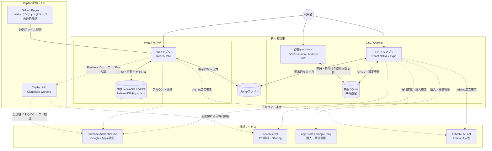
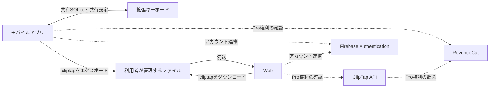
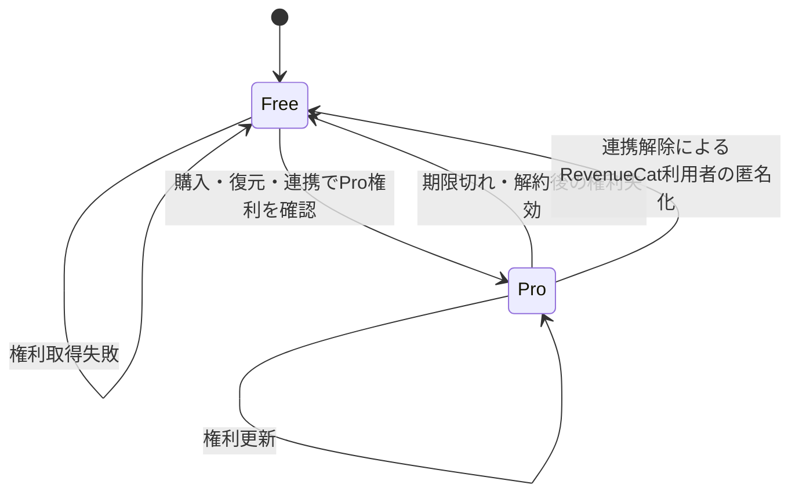
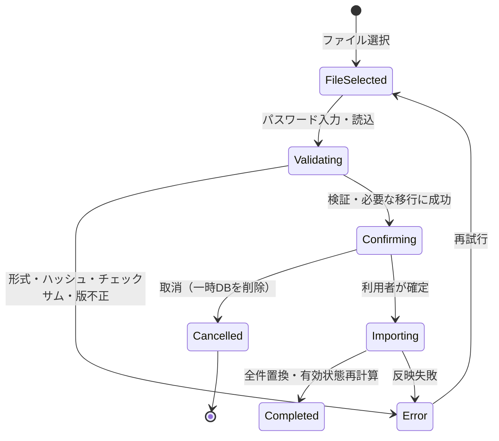
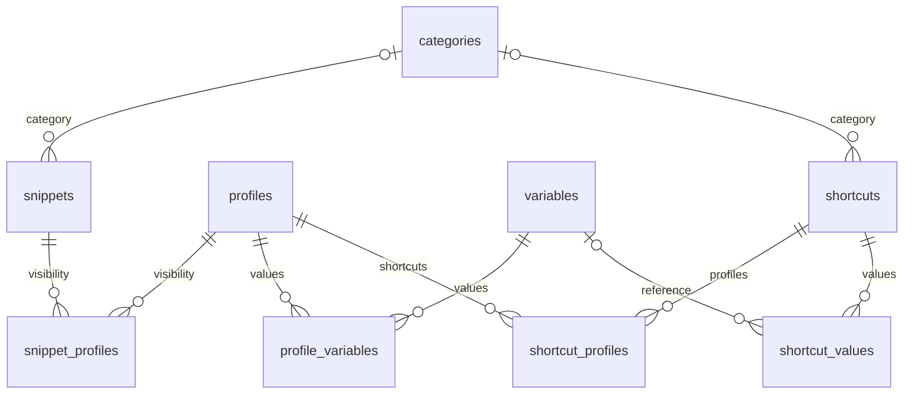

# ClipTap 機能仕様書

## 1. 文書情報

| 項目 | 内容 |
|---|---|
| 文書名 | ClipTap 機能仕様書 |
| 文書版 | 1.11 |
| 基準日 | 2026-09-14 |
| 対象アプリ版 | 1.4.0 |
| モバイルビルド番号 | iOS 60、Android 41 |
| 対象データベース | SQLite スキーマ V8 |
| 対象プラットフォーム | iOS、Android、Web、iOS拡張キーボード、Android IME |
| 最低対応OS | iOS / iPadOS 17.0以上、Android 7.0（API 24）以上 |
| 正本 | 基準日時点のソースコードと設定を機能仕様の唯一の正本とする |

### 1.1 本書の読み方

- 「共通」は、モバイルアプリとWebで同じ業務ルールを使用することを示す。
- 「モバイル」は、iOSとAndroidのメインアプリを示す。
- 「キーボード」は、iOS拡張キーボードとAndroid IMEを示す。
- 「現行」は、基準日時点のソースコードまたは設定から確認できる動作を示す。
- 実装と本書が異なる場合はソースコードと設定を正とし、本書を現行実装へ合わせる。

### 1.2 仕様の根拠

- 実行コード、データベース定義、ビルド・配信設定およびそれらから参照される静的データだけを現行仕様の根拠とする。
- 公開文書、運用手順、コメント、過去の設計書やテストメモだけに根拠を持つ要件は、現行機能として扱わない。

## 2. 目的・位置づけ

ClipTapは、定型文をローカルで管理し、利用場面に応じて変数を展開して、クリップボードまたは拡張キーボードから素早く入力するためのアプリケーションである。

本書の目的は次のとおり。

- 利用者から見える機能、制約、エラー、プラットフォーム差を一つの文書で確認できるようにする。
- モバイル、Web、キーボードで共有する業務ルールを定義する。
- 外部サービス、ファイル形式、データベース、非機能要件の境界を明確にする。
- 旧文書に分散していた記載を、基準日時点の実装仕様として統合する。

本書は外部設計レベルの仕様であり、画面内部のコンポーネント構成、クラス、関数、ソースコードの配置は定義しない。

## 3. システム概要

### 3.1 提供形態

| 提供形態 | 主な役割 | データの置き場所 |
|---|---|---|
| iOS / Androidアプリ | 定型文・カテゴリ・プロファイル・変数・ショートカットの管理、コピー、入出力、購入・復元 | 端末内SQLite |
| iOS拡張キーボード | 共有データの絞り込み・展開・入力、ショートカット値の挿入 | App Group内の共有SQLiteと共有設定 |
| Android IME | 共有データの絞り込み・展開・入力、ショートカット値の挿入 | アプリと同一領域のSQLite、IME内のローカル設定 |
| Web | `.cliptap`ファイルの読込、PCでの管理、再エクスポート | メモリ上のSQLite WASM、OPFS、IndexedDBキャッシュ |
| ランディングページ | 製品紹介、法的文書、ストア導線 | 静的Web配信 |

### 3.2 基本方針

- 定型文などの業務データはローカルファーストで扱う。
- アカウント連携はPro権利の共有に使用し、業務データをクラウド同期しない。
- キーボードは業務データの作成・編集・削除を行わない。表示、変数展開、入力、および条件を満たす場合の使用回数更新だけを行う。
- Webはサーバー側データベースを持たず、利用者が読み込んだデータをブラウザ内で処理する。
- 日本語と英語を提供し、原則として端末またはブラウザの言語に従う。

### 3.3 システム構成

実線は利用者操作、端末内連携、ファイル入出力または静的配信、破線はネットワーク経由の外部連携を示す。定型文、カテゴリ、プロファイル、変数などの業務データは利用者端末または利用者が管理する `.cliptap` ファイルにだけ保存する。ClipTap APIはWebのPro権利判定だけを中継し、業務データを送受信・保存しない。

### 3.4 データの流れ

ファイル交換は利用者の明示操作で行う。モバイルとWebの間に自動同期はない。

## 4. 対象範囲・前提

### 4.1 対象範囲

- 定型文、カテゴリ、プロファイル、カスタム変数の管理
- ショートカットとショートカット値の管理、キーボードからのショートカット値の挿入
- システム変数・カスタム変数の展開
- 検索、絞り込み、並べ替え、プレビュー、コピー、キーボード入力
- `.cliptap`による全データのバックアップ（エクスポート）と復元（全件置換）
- Free / Proの機能制御、購入、復元、アカウント連携
- 広告、トラッキング同意、テーマ、言語、法的文書
- ローカルデータベースとスキーマ移行
- Webの静的配信とブラウザ内キャッシュ

### 4.2 対象外

- 定型文データのクラウド同期、共同編集、サーバーバックアップ
- WebからのPro購入・解約
- キーボードからの業務データCRUD
- 通知、定期実行、バックグラウンド同期
- 管理者用画面、組織・ロール管理、監査ログ
- ファイルの強固な暗号化、パスワード再発行
- Webの `file://` 直接起動。WebはHTTPまたはHTTPS配信を前提とする。

### 4.3 動作前提

- モバイルの業務機能は、外部認証なしでも利用できる。
- iOSキーボードで業務データを表示するには、メインアプリが共有データベースを作成済みである必要がある。Android IMEはデータベースがない場合に空のデータベースを作成する。
- iOSで使用回数を書き込むには、キーボードのフルアクセス許可が必要である。iOSのサンドボックスは、許可のない拡張から共有領域への書き込みを禁止する。
- Webの初回利用では、対象ファイル、同ファイルに設定したパスワード、利用規約・プライバシーポリシーへの同意が必要である。IndexedDBの固定キーにキャッシュレコードがある場合は、期限やチェックサムの判定なしで復元を試みる。
- 認証、サブスクリプション、広告、ストア画面の利用にはネットワーク接続が必要である。

## 5. 用語

| 用語 | 定義 |
|---|---|
| 定型文（snippet） | 再利用するタイトルと本文。カテゴリは0～1件、プロファイルは0件以上を関連付ける。変数はタイトルまたは本文内のトークンとして参照する。 |
| カテゴリ | 定型文を色と名称で分類する単位。削除しても定型文は削除されない。 |
| プロファイル | 利用場面ごとの変数値と定型文表示範囲を切り替える単位。旧文書の「環境」と同義。 |
| 標準プロファイル | 初期作成され、削除できない基準プロファイル。 |
| アクティブプロファイル | DBの `isActive` で示す、メインアプリとWebの変数値・定型文絞り込みの初期基準。モバイル検索とキーボードは画面内の一時選択を使う場合がある。 |
| システム変数 | 日付・時刻などを実行時に生成する予約変数。変数本体は保存せず、選択された書式だけをデータベースへ保存する。 |
| カスタム変数 | 利用者が名前とプロファイル別の値を登録する変数。 |
| 標準値 | カスタム変数に対する標準プロファイルの値。アクティブプロファイル固有値がない場合のフォールバックになる。 |
| 変数トークン | `{{name}}` 形式で定型文に埋め込む置換対象。 |
| ショートカット（shortcut） | 拡張キーボードから呼び出す値のまとまり。名称と1件以上のショートカット値を持ち、プロファイルは0件以上を関連付ける（0件は全プロファイル向け）。定型文と共通のカテゴリを0〜1件持てる。本体は変数・定型文と関連を持たない（カスタム変数の参照はショートカット値が持つ）。 |
| ショートカット値 | ショートカットに属する値名と、挿入する値の組。値の代わりにカスタム変数を参照することもできる。キーボードで選ぶと、値名を除いた値だけを入力欄へ挿入する。 |
| 有効 / 無効 | 現在のプラン上限内で使用できるかを表す状態。無効でもデータは削除しない。 |
| 使用回数 | 定型文をコピーまたはキーボード入力した回数、およびショートカット値をモバイルでコピーまたはキーボードから挿入した回数。対応条件を満たす経路だけが加算する（§8.12）。 |
| バックアップ | 全業務データを `.cliptap` ファイルへ出力すること（全件エクスポート）。 |
| 復元（全復元） | 現在の業務データを削除し、バックアップファイルの内容で置き換えるインポート方式。 |
| `.cliptap` | SQLiteバイナリをJSONで包んだClipTap交換ファイル。暗号化形式ではない。 |
| App Group | iOSアプリと拡張キーボードがデータベース・設定を共有するOS領域。 |

## 6. 利用者・権限・プラン

### 6.1 利用者区分

| 区分 | 認証 | 利用可能範囲 |
|---|---|---|
| ゲスト | なし | ローカル業務機能、Free機能。Webもファイルを読み込めば利用可能。 |
| 連携済み利用者 | GoogleまたはApple | ゲスト機能に加え、同じFirebase UIDを介したPro権利の確認。業務データ同期はしない。 |
| Pro利用者 | RevenueCatの `Pro` entitlementが有効 | 広告非表示、Freeのプロファイル・カスタム変数・定型文・ショートカット・ショートカットの値の上限を適用しない。 |

Apple認証はiOSモバイルとWeb、Google認証はiOS・AndroidモバイルとWebで提供する。認証プロバイダーが利用できない環境では、その選択肢を表示しないかエラーを案内する。

### 6.2 Free / Pro比較

| 項目 | Free | Pro |
|---|---:|---:|
| 定型文 | 50件まで | 上限なし |
| カテゴリ | 上限なし | 上限なし |
| ショートカット | 10件まで（全プロファイル合計） | 上限なし |
| ショートカットの値 | 1ショートカットあたり2件まで | 上限なし |
| 有効なプロファイル | 3件まで | 再計算上999,999件まで |
| 有効なカスタム変数 | 5件まで | 再計算上999,999件まで |
| 広告 | モバイルはAdMobのバナーと起動時全画面、WebはA8.netを表示 | 非表示 |
| バックアップ / 復元 | 利用可 | 利用可 |
| アカウント連携 | 利用可 | 利用可 |
| Web編集 | 利用可 | 利用可 |
| キーボード | 利用可（件数上限なし） | 利用可（件数上限なし） |

有効件数は標準プロファイルを優先し、その後は保存済みの表示順で判定する。Freeへ変更したときは上限超過分を物理削除せず無効にする。無効になったプロファイルがアクティブだった場合は、標準プロファイルへ切り替える。Proの再計算ではプロファイルとカスタム変数をそれぞれ最大999,999件まで有効にする。

定型文とショートカットの上限は、全プロファイルを通した保存済み総数に対する新規登録の上限である。上限を超えて保存されている定型文・ショートカットも無効化・削除せず、一覧、検索、コピー、キーボード入力、編集、削除を引き続き利用できる。Freeで総数が上限（定型文50件・ショートカット10件）以上の間は新規登録だけを拒否する（§8.2、§8.24、§8.18）。ショートカットの値は1ショートカットあたり2件までとし、Freeで値が2件以上のショートカットには値を追加できない。3件以上の値を既に持つショートカット（Pro加入中に登録したもの等）も無効化・削除せず、値を増やさない限り編集して保存できる（§8.24）。

### 6.3 価格と課金

- 現行UIの基準価格は月額250円、年額3,000円である。
- 実際の価格、通貨、無料トライアル、販売可否はストアおよびRevenueCat Offeringの値を優先する。
- 購入、購入復元、サブスクリプション管理画面への遷移はモバイルだけが提供する。
- WebはログインしたUIDの権利確認を行えるが、購入処理は行わない。
- 通常の権利更新に失敗した場合は画面上をFree扱いにするが、DBの有効フラグは更新しない。Webはログイン中のダッシュボードに限り警告と再試行導線を表示する。初回ファイル読込とインポートの再計算はこの経路と異なり、§8.14、§8.18に従う。

### 6.4 アカウント連携時の処理

- モバイルはFirebase認証後にRevenueCatへUIDでログインし、返却されたCustomerInfoを保持する。その時点でProでなければ購入復元を試み、復元失敗は警告ログだけで連携処理を継続する。
- WebはFirebase認証後にIDトークンをClipTap APIへ送り、検証済みUIDに対するRevenueCat権利を取得する。
- モバイルは連携解除時にRevenueCatからもログアウトし、以後は匿名利用者として権利を判定する。Webは課金プロバイダのSDKを持たないため、解除時にRevenueCatへの操作を行わない。
- ログアウト後に購入復元を自動実行しない。購入復元はレシートを現在の利用者識別へ再送する操作であり、ストア認証の入力を求め得るため、利用者の明示操作でのみ実行する。端末自身で購入したProは§8.17の購入復元、または再度の連携で回復する。
- アカウント連携・解除でローカル業務データとWebキャッシュは消去しない。

## 7. 機能一覧

| ID | 機能 | モバイル | Web | キーボード |
|---|---|:---:|:---:|:---:|
| F-01 | 初期化・データ読込 | ○ | ○ | ○ |
| F-02 | 定型文CRUD | ○ | ○ | 参照のみ |
| F-03 | カテゴリCRUD | ○ | ○ | 参照のみ |
| F-04 | プロファイルCRUD・切替 | ○ | ○ | ローカル切替・参照 |
| F-05 | カスタム変数CRUD・値設定 | ○ | ○ | 参照のみ |
| F-06 | システム変数展開 | ○ | ○ | ○ |
| F-07 | 検索 | ○ | ○ | ― |
| F-08 | カテゴリ・プロファイル絞り込み | ○ | ○ | ○ |
| F-09 | 並べ替え | ○ | ○ | ○ |
| F-10 | プレビュー | ○ | ○ | ○ |
| F-11 | コピー・キーボード入力 | コピー | コピー | 入力 |
| F-12 | 使用回数記録 | ○ | ○ | 条件付き |
| F-13 | バックアップ（全件エクスポート） | ○ | ○ | ― |
| F-14 | 復元（全件置換） | ○ | ○ | ― |
| F-15 | Webワークスペース・キャッシュ | ― | ○ | ― |
| F-16 | アカウント連携・解除 | ○ | ○ | ― |
| F-17 | 購入・復元・管理 | ○ | 状態確認のみ | ― |
| F-18 | プラン上限再計算 | ○ | ○ | 結果参照 |
| F-19 | 広告・トラッキング同意 | ○ | ○ | ― |
| F-20 | テーマ・言語 | ○ | ○ | ○ |
| F-21 | 法的文書・アプリ情報 | ○ | ○ | ― |
| F-22 | キーボード設定・状態案内 | ○ | ― | ○ |
| F-23 | システム変数書式設定 | ○ | ○ | 参照のみ |
| F-24 | ショートカット管理 | ○ | ― | 参照・挿入 |

`―` は対象外を示す。キーボードの「参照」は、メインアプリで保存した有効データの利用を指し、「挿入」はその内容を入力欄へ入力することを指す。
各機能の詳細は第8章の同じ番号の節で定義する（`F-NN` は `8.NN`）。

## 8. 機能仕様

本章は第7章の機能一覧と1対1で対応し、節番号 `8.N` を機能ID `F-N` に一致させる。複数機能にまたがる規則は中心となる節に記載し、他節から参照する。

各節は次の4区分で記述する。

| 区分 | 記載内容 |
|---|---|
| 機能概要 | その機能が何を行うものかを1文で示す |
| 事前条件 | その機能を利用できるようになるための条件 |
| 事後条件 | その機能を利用した結果として成立している状態 |
| 機能詳細 | 利用者から見た動作、入力制約、プラットフォーム差 |

### 8.1 初期化・データ読込（F-01）

#### 機能概要

- アプリまたはWebワークスペースの起動時に、業務データを利用できる状態へ初期化する機能。

#### 事前条件

- モバイルは対応OS（iOS / iPadOS 17.0以上、Android 7.0以上）で本アプリを起動していること。
- Webはブラウザでアプリ画面を開き、IndexedDBの固定キーに保存済みキャッシュがあるか、`.cliptap`ファイルとそのパスワードを用意していること。
- Webでキャッシュがない場合は、利用規約・プライバシーポリシーへ同意すること。
- iOSキーボードは、メインアプリが共有データベースを初期化済みであること。
- ネットワーク接続および認証状態は前提としない。

#### 事後条件

- DB初期化に成功した場合はV8スキーマで利用可能になる。初回作成時は標準かつアクティブな `Main` プロファイルを作成する。
- 保存済みのプラン、使用頻度設定、アクティブプロファイルが読み込まれ、§8.2以降の機能が利用できる。
- 外部サービスの初期化に失敗した場合も、Freeとして業務機能を継続する。
- Webは読み込んだデータベースをブラウザキャッシュとして保持する（§8.15）。
- iOSキーボードは共有DBを開けない場合に読込失敗を表示する。Android IMEはDBがない場合に空DBを作成し、プロファイル0件では案内を出さず空一覧を表示する。

#### 機能詳細

##### モバイル

1. 共有データベースを開く。
2. 未作成ならV8スキーマ、インデックス、標準プロファイル `Main` を作成する。
3. 既存スキーマが古い場合は順番に移行する。
4. `__DEV__` ビルドはDB初期化成功のたびにテストデータ投入を試みる。定型文またはカスタム変数が1件でもあれば投入せず、両方が0件の場合だけ、カテゴリ3件、定型文5件、`Main` 以外のプロファイル2件、カスタム変数3件、ショートカット8件を投入する。ショートカットはカテゴリ付きと未分類の両方を含む。
5. 保存済みのプラン、使用頻度設定、アクティブプロファイルを読み込む。
6. 外部サービスの初期化失敗は業務データの読込を妨げず、利用可能な範囲でFreeとして継続する。
7. DB初期化に失敗した場合はエラーをログに記録し、初期化試行完了としてナビゲーション表示へ進む。利用者向けのDBエラーは表示しない。

##### Web

1. IndexedDBの固定キーにキャッシュレコードがある場合は、タイムスタンプ、期限、利用者ID、チェックサムを検証せずに同一ブラウザのワークスペース復元を試みる。レコードにシステムDBが含まれる場合はそれをOPFSへ書き出して開く。含まれない旧形式レコードの場合は、OPFSに残っている古いシステムDBを削除してから開き直し、レコード内の旧版情報を版の判定に使う。
2. キャッシュがない場合は、`.cliptap`ファイルとパスワードの入力、利用規約・プライバシーポリシーへの同意を求める。
3. 読込画面には共有端末のブラウザへデータを保存することへの注意を表示する。両同意チェックは画面内だけで保持し、画面を開き直すと未同意に戻る。
4. モバイルアプリを持たない利用者向けに、同画面でサンプルデータ入りのベースファイルを配布する。
5. ファイルを検証し、最新スキーマへの移行を一時DB上で完了してから、その結果だけをメモリ上のSQLite WASMへメインDBとして読み込む（§8.14）。
6. 認証のログイン・ログアウトをまたいでも同じローカルキャッシュを使用する。UID別の業務データ分離は行わない。

###### ベースファイル

| 項目 | 仕様 |
|---|---|
| 配布物 | Webの静的配信物に同梱する `starter_v{スキーマバージョン}_{言語}.cliptap`。利用者のダウンロード保存名は `ClipTap_starter.cliptap` |
| 言語 | 表示言語に応じて日本語版・英語版を切り替える。非対応言語は英語版とする |
| 内容 | 標準プロファイル `Main`、カテゴリ3件、カスタム変数3件、定型文3件。システム変数をタイトルと本文で使う例を含む。ショートカットは含まない |
| パスワード | 公開サンプルのため固定値 `cliptap` とし、読込画面に表示する。ダウンロード時にパスワード欄が空であれば自動入力する |
| 生成元 | Webのスターター生成スクリプト、V8スキーマ定義、日本語・英語のスターターデータ |
| 互換配信 | 読込画面のダウンロード導線はV8だけを参照する。旧版のベースファイルは配信しない。V6・V7の日本語版・英語版は移行の回帰テスト用fixtureとして `packages/shared/tests/fixtures/starter/` に保持する |

##### キーボード

- iOSはキーボード表示のたびにDBの初期化・接続状態を確認し、接続済みならその接続を再利用する。その上でシステム変数書式、選択中プロファイルの変数値、定型文を再取得する。プロファイルとカテゴリは、件数またはID列が変化した場合だけ一覧を置き換える。このためID列が同じまま名称、アクティブ状態、色などが変化しても、その表示回には反映されない場合がある。初回読込時の初期化・接続失敗は読込失敗を表示する。表示中の再読込で失敗した場合はDebugログだけに記録し、現在の表示を維持する。
- iOSは表示中に選択中のカテゴリがメインアプリで削除されても現在選択を解除せず、カテゴリ配列とメニューだけを更新する。利用者が「すべて」または別カテゴリを選択するまで、削除済みの名称と空一覧が残り得る。
- AndroidはIMEビュー作成時にデータを読み込む。入力欄の切替だけでは再読込しないため、メインアプリの変更はIMEビュー再作成まで反映されない場合がある。DBがなければ空DBを作成する。
- ショートカットは定型文の再取得とは別に、ショートカット表示へ切り替えるたびに読み直す（§8.24）。
- Free / Proにかかわらず、共有データベースを読み込める場合は定型文を表示する。
- キーボード自身はサブスクリプション状態を保持・判定せず、DBの `valid=1` のプロファイルとカスタム変数を参照する。

### 8.2 定型文管理（F-02）

#### 機能概要

- 定型文の作成、編集、削除を行う機能。

#### 事前条件

- §8.1の初期化が完了していること。
- モバイルまたはWebで操作すること。キーボードは参照だけを行い、作成・編集・削除を提供しない。
- モバイルはタイトルと本文を入力していること。Webはタイトルが空でないときに保存操作を有効にする。
- カテゴリまたは対象プロファイルを関連付ける場合は、対象が登録済みかつ有効であること（§8.18）。
- Freeでは、全プロファイルを通した定型文の保存済み総数（無効なプロファイルにだけ関連するものを含む）が50件以上の場合に新規保存を拒否して上限メッセージを表示する（§10.4）。モバイルのホームの追加ボタン、モバイルの作成画面の保存時（ディープリンク `cliptap://snippet/create` から開いた場合を含む）、Webの追加ボタンと作成モーダルの保存時はいずれも同じ総数で判定する。編集は制限しない。権利確認中の扱いは§8.18で定義する。

#### 事後条件

- 保存した定型文が一覧、検索（§8.7）、コピー・キーボード入力（§8.11）の対象になる。
- 内容を更新した場合は更新日時が更新される。コピーだけでは更新されない。
- 削除した場合は定型文本体とプロファイル関連だけが物理削除され、カテゴリ、プロファイル、変数本体は残る。
- モバイルは保存せずに戻る場合、確認なしで入力内容を破棄する。Webは変更後にモーダルを明示的に閉じると破棄確認を表示し、ページ再読込み・タブ終了時はブラウザ標準の離脱確認を行う。

#### 機能詳細

| 項目 | 仕様 |
|---|---|
| 作成・編集 | タイトル、本文、カテゴリ、対象プロファイル、タイトル同時コピーを設定する。モバイルとWebはタイトル・本文の前後空白を除去して保存する。 |
| タイトル | 画面上は必須、改行不可、30文字まで。保存層では既存・取込データ互換のためNULLと30文字超を保持する。モバイルの入力画面ではカーソル位置へシステム変数・有効なカスタム変数を挿入できる。 |
| 本文 | モバイルでは必須。Webは新規作成時に空本文を共通サービスが拒否するが画面にエラーを表示せず、既存定型文の編集では空本文を保存できる。システム変数・カスタム変数を挿入でき、文字数上限はない。 |
| カテゴリ | 任意。1件だけ関連付けられる。 |
| 対象プロファイル | 0件以上。関連が0件の場合は「すべてのプロファイル」で表示する。新規作成時はアクティブなプロファイル（§8.4）が既定でチェックされ、すべて外せば全プロファイル向けになる。無効なプロファイル（§8.18）は選択肢に表示せず、既定のチェックにも入れない。モバイルとWebで同じ扱いとする。 |
| タイトル同時コピー | モバイル本体とWebのコピーで、ONなら展開後のタイトル、改行、展開後の本文を連結する。本文が空または空白だけの場合は改行を付けず展開後のタイトルだけを対象にする。OFFなら本文だけを対象にする。キーボードではタイトルと本文を別々に挿入するため、この設定はタイトル行と挿入ボタンの表示可否だけを決める（§8.10、§8.11参照）。 |
| 削除 | 定型文本体とプロファイル関連を物理削除する。カテゴリ、プロファイル、変数本体は削除しない。 |
| 更新日時 | 内容を更新したときに更新する。コピーだけでは更新しない。 |
| Free制限 | 全プロファイルを通した保存済み総数で50件まで新規登録できる。プロファイルごとには数えず、複数のプロファイルに関連する定型文も全プロファイル向けの定型文も1件と数え、無効なプロファイルにだけ関連する定型文も含める。50件以上の場合は新規登録だけを拒否し、超過分を含む既存の定型文は無効化・削除せず、一覧、検索、コピー、キーボード入力、編集、削除を引き続き利用できる。モバイルは上限メッセージを確認ダイアログで表示し、OKでPaywallへ遷移する。保存時に拒否した場合は作成画面を閉じず、入力内容を保持する。Webは同じ文言のエラーを表示し、追加ボタンでは作成モーダルを開かず、保存時は保存しない。Proでは適用しない（§6.2、§8.18）。 |

モバイルは段階的な入力画面、Webはモーダルで編集する。モバイルは未保存離脱の確認を行わず、Webはモーダルを閉じる操作とページ離脱で確認を行う。

### 8.3 カテゴリ管理（F-03）

#### 機能概要

- 定型文を分類するカテゴリの作成、編集、削除を行う機能。

#### 事前条件

- §8.1の初期化が完了していること。
- モバイルまたはWebで操作すること。
- 名称を入力し、既存カテゴリと重複していないこと。

#### 事後条件

- 追加・変更したカテゴリが、定型文とショートカットの編集の選択肢、および一覧の絞り込み（§8.8）へ反映される。
- 削除した場合も関連する定型文とショートカットは削除されず、`未分類` になる。
- 新規カテゴリは保存済み表示順の末尾へ追加される。
- Webは変更後に編集モーダルを明示的に閉じると破棄確認を表示し、ページ再読込み・タブ終了時はブラウザ標準の離脱確認を行う。変更がなければ確認せず閉じる。

#### 機能詳細

- 名称は前後空白を除去し、空白だけは拒否する。入力UIで20文字以内、大文字・小文字を区別した完全一致で重複不可とする。保存層は既存・取込データ互換のため長さ超過を拒否しない。
- 色は12種類のプリセットまたはRGB各0～255のカスタム色から選択できる。カスタム色は大文字の `#RRGGBB` へ変換して保存する。編集画面を開くときは、保存値の前後空白を除去し、大文字・小文字を区別せずにプリセットかどうかを判定する。プリセットに一致しない値のうち `#RRGGBB` として読み取れないものは、RGB入力欄を既定色の値で開く。この判定はモバイルとWebで共通とする。
- `sortOrder`順で表示し、新規作成時は現在の最大値+1で末尾へ追加する。モバイルとWebの現行UIは手動並べ替えを提供しない。
- カテゴリ削除時は、関連する定型文とショートカットを削除せず `未分類` にする。実行時に外部キーを強制しないため、どちらも明示的な更新で `未分類` へ戻す。
- Webではカテゴリ未指定の定型文を `未分類` として絞り込みできる。モバイルには未分類専用候補がなく、「すべて」に含めて表示する。

### 8.4 プロファイル管理（F-04）

#### 機能概要

- 変数値の切替単位であるプロファイルの作成、名称編集、削除、アクティブ切替、標準切替を行う機能。

#### 事前条件

- §8.1の初期化が完了していること。
- 作成・編集・削除・標準切替はモバイルまたはWebで操作すること。キーボードは切替と参照だけを行う。
- 名称を入力し、既存プロファイルと重複していないこと。
- アクティブ切替・標準切替のどちらも、対象は有効なプロファイルであること。
- Freeでは、無効を含む保存済みプロファイル総数が3件以上の場合に新規保存を拒否して上限メッセージを表示する（§10.4）。モバイルの一覧入口、モバイルの編集画面の保存時、Webの追加ボタンはいずれも同じ総数で判定する。

#### 事後条件

- 通常の作成・切替・削除では、有効なアクティブプロファイルが1件確定し、変数展開（§8.6）と絞り込み（§8.8）の基準になる。全復元では§8.14の例外がある。
- 削除した場合はそのプロファイルの変数値・定型文関連が物理削除され、定型文と変数本体は残る。ショートカットは、そのプロファイルだけに関連するものが値ごと物理削除され、他のプロファイルにも関連するものは削除したプロファイルとの関連だけが外れる。関連が0件（全プロファイル向け）のショートカットは変わらない（§8.24）。
- アクティブな非標準プロファイルを削除した場合は標準プロファイルへ切り替わる。
- 標準を切り替えた場合は標準が1件だけ残り、変数値のフォールバック（§8.6）と上限判定（§8.18）の優先対象が切替先へ移る。アクティブは変わらない。
- 新規プロファイルは保存済み表示順の末尾へ追加される。
- Free上限を超えた分は削除されず無効になる（§8.18）。
- Webは変更後に編集モーダルを明示的に閉じると破棄確認を表示し、ページ再読込み・タブ終了時はブラウザ標準の離脱確認を行う。変更がなければ確認せず閉じる。

#### 機能詳細

名称は前後空白を除去し、空白だけは拒否する。入力UIで20文字以内、大文字・小文字を区別した完全一致で重複不可とする。保存層は既存・取込データ互換のため長さ超過を拒否しない。

- 初期データでは `Main` が標準かつアクティブである。
- 標準プロファイルは削除できない。
- 有効なプロファイルのうち1件をアクティブにする。無効なプロファイルは切替の選択肢に表示せず、指定された場合は標準プロファイルへ振り替える。
- アクティブな非標準プロファイルを削除した場合は標準へ切り替える。
- 削除時は、そのプロファイルの変数値と定型文関連を物理削除する。定型文・変数本体は削除しない。ショートカットは、そのプロファイルだけに関連するものの値・本体・関連を物理削除し、他のプロファイルにも関連するものは削除するプロファイルとの関連だけを外す（§8.24）。そのプロファイルだけに関連するものの関連だけを外すと関連0件になり、全プロファイル向けへ広がって他のプロファイルにも現れるためである。関連が0件のショートカットは、もともと特定のプロファイルに限定されていないため変更しない。「他のプロファイルにも関連する」かどうかは、存在するプロファイルとの関連だけで判定する。存在しないプロファイルとの関連まで数えると、削除後にその関連だけが残り、どのプロファイルからも見えないまま消せない行になるためである。値と本体は関連を手掛かりに探すため、関連の削除は本体の削除より後に行う。この削除はモバイルとWebで共通の削除経路が行うため、管理画面を持たないWebからの削除でも同様に消える。
- 標準プロファイルを先頭に置き、その後は `sortOrder`順で表示する。新規作成時は現在の最大値+1で末尾へ追加する。モバイルとWebの現行UIは手動並べ替えを提供しない。この並びは有効・無効の判定順（§8.18）と一致するため、一覧の上から有効件数分が有効なプロファイルになる。
- この並びはモバイルアプリ、Web、キーボードのすべてに適用する。キーボードは共有データを独自実装で読むため、同じ並び順を各実装で維持する。
- アクティブ切替はモバイルのホームとWebダッシュボードで行う。ホームのプロファイル選択は定型文とショートカットの両方の表示対象を決め、変数展開の基準にもなる。新規作成の初期値もアクティブプロファイルで、定型文とショートカットのどちらでも対象プロファイルの既定チェック（§8.2、§8.24）になる。プロファイル管理画面ではアクティブを切り替えず、標準の切替だけを行う。モバイルの選択モーダルでアクティブ切替に失敗した場合はモーダルを閉じ、汎用エラー `エラーが発生しました` を表示する。
- 標準切替はモバイルとWebのプロファイル管理画面の一覧行から行う。確認後に即時反映し、標準の表示が切替先へ移る。無効なプロファイルには切替操作を表示せず、指定された場合はエラーとする（§10.4）。切替直後に有効・無効を再計算する（§8.18）。
- Freeでは標準プロファイルを優先して合計3件まで有効にする。上限超過分は表示を残したまま無効にする。有効・無効の判定は§8.18で定義する。標準が表示順の下位にある状態から上位へ切り替えると、有効なプロファイルの組み合わせが入れ替わることがある。

### 8.5 カスタム変数管理（F-05）

#### 機能概要

- 定型文へ差し込むカスタム変数と、その標準値・プロファイル別値を管理する機能。

#### 事前条件

- §8.1の初期化が完了していること。
- モバイルまたはWebで操作すること。キーボードは参照だけを行う。
- 変数名が形式規則を満たし、システム予約名（§8.6）および既存のカスタム変数名と重複しないこと。
- プロファイル別値を設定する場合は、対象プロファイルが登録済みであること。
- Freeでは、モバイルとWebのどちらも無効を含む保存済みカスタム変数総数が5件以上の場合に新規保存を拒否して上限メッセージを表示する（§10.4）。

#### 事後条件

- 登録した変数が定型文編集の挿入候補になり、展開（§8.6）の対象になる。
- 削除しても定型文中のトークンは書き換えられず、未解決トークンとして残る。
- 削除した変数を参照していたショートカット値は、参照だけが外れて値自体は残り、保存されている値へ戻る（§8.24）。
- 名前を変更しても定型文中の既存トークンは自動更新されない。
- Free上限を超えた分は削除されず無効になり、展開候補と選択肢から除外される（§8.18）。
- Webは変更後に編集モーダルを明示的に閉じると破棄確認を表示し、ページ再読込み・タブ終了時はブラウザ標準の離脱確認を行う。変更がなければ確認せず閉じる。

#### 機能詳細

| 項目 | 仕様 |
|---|---|
| 名前 | 前後空白を除去し、空白だけは拒否する。入力UIは30文字まで。英字または `_` で始まり、以降は英数字または `_`。システム予約名は英字の大小を区別せず判定し、カスタム変数同士は大小を区別した完全一致で判定する。保存層は既存・取込データ互換のため長さ上限を設けない。 |
| 表示ラベル | 任意。前後空白を除去して保存する。入力UIは30文字まで。未設定時は変数名を表示する。 |
| アイコン | 任意。選択したアイコンは新規作成時・更新時とも保存し、未設定の場合は既定アイコンを表示する。 |
| 値 | 標準値または1件以上のプロファイル別値を登録する。モバイルとWebのどちらも、必須判定では各値の前後空白を除去し、少なくとも1値が空でないことを必須とする。保存もモバイル・Webのどちらも、標準値・プロファイル別値ともに前後空白を除去して行うため、空白だけの値は空文字として保存される。標準値が空でプロファイル別値だけが入力されている場合は、確認後に保存する。 |
| 表示順 | `sortOrder`順で表示し、新規作成時は現在の最大値+1で末尾へ追加する。モバイルとWebの現行UIは手動並べ替えを提供しない。 |
| 削除 | 変数本体と全プロファイル値を物理削除する。定型文中のトークンは書き換えない。この変数を参照するショートカット値は、参照（`variableId`）をNULLへ戻して値自体は残す。カテゴリ削除で`categoryId`をNULLへ戻すのと同じ扱いで、参照が残ると存在しない変数を指したまま解決を試み続けるためである（§8.24）。 |
| 名前変更 | 定型文中の既存トークンは自動更新しない。 |
| Free制限 | 表示順で5件まで有効。超過分は削除せず無効にする。 |

予約名は第8.6節の日本語・英語エイリアスを含む。無効な変数は管理画面に残すが、通常の展開候補やキーボード利用から除外する。
モバイルのプロファイル別値編集サブ画面は、既存カスタム変数の値を保存するとその場でDBへ反映する。その後に親の変数編集画面を保存せず閉じても値は元に戻らない。未作成の変数では値を親画面へ返すだけで、親画面の保存時にDBへ反映する。
値の解決順序は§8.6、有効・無効の再計算は§8.18で定義する。

### 8.6 システム変数展開（F-06）

#### 機能概要

- 定型文のタイトルと本文に含まれる変数トークンを、実行時点の値へ置き換える機能。

#### 事前条件

- 対象の定型文が保存済みであるか、編集画面で入力中であること。
- 展開の基準プロファイルが確定していること。ホームとWebはアクティブプロファイル、モバイル検索・編集プレビュー・キーボードはその画面内で選択中のプロファイルを使う。
- 端末またはブラウザのローカル日時を取得できること。
- カスタム変数を展開する場合は、対象変数が有効であること（§8.18）。

#### 事後条件

- タイトルと本文のトークンが展開され、プレビュー表示（§8.10）、クリップボード保存、キーボード挿入（§8.11）の対象文字列になる。
- 値を解決できないトークンは元の形のまま残る。
- 展開処理は保存済みの定型文、変数、プロファイルを変更しない。

#### 機能詳細

システム変数の出力書式の選択はF-23（§8.23）で定義する。

| 英語名 | 日本語名 | 既定書式 | 既定出力例 |
|---|---|---|---|
| `today` | `今日` | `yyyy/MM/dd` | `2026/08/04` |
| `now` | `現在` | `yyyy/MM/dd HH:mm:ss` | `2026/08/04 09:05:07` |
| `time` | `時刻` | `HH:mm` | `09:05` |
| `year` | `年` | `yyyy` | `2026` |
| `month` | `月` | `MM` | `08` |
| `day` | `日` | `dd` | `04` |
| `weekday` | `曜日` | `EEE` | 日本語は `火`、英語は `Tue` |

- トークン形式は `{{today}}` のように二重波括弧で囲む。括弧内の名前は前後の空白と改行を除去して照合するため、`{{ today }}` も展開する。英語名はASCIIの大小を区別せず、日本語名は完全一致で全環境が解決する。
- トークン内書式 `{{today:yyyy-MM-dd}}` は対応せず、未解決トークンとして保持する。

##### 展開の共通規則

プレビュー（§8.10）、コピー、キーボード入力（§8.11）に共通して適用する。

1. 展開はタイトルと本文の双方に適用する。
2. システム変数を先に、次にカスタム変数を展開する。
3. 日付・時刻は、実行した時点の端末またはブラウザのローカル時刻を使用する。
4. カスタム変数は全実装で「有効な基準プロファイルの非空値」→「標準プロファイルの非空値」→「元トークン」の順に解決する。基準プロファイルは前記の画面ごとの選択に従う。
5. 展開できないトークンは原則として元の形を残す。

コピー時の変数展開処理が例外になった場合は、保存済みの未展開タイトル・本文をコピー対象とする。

変数編集画面で値を入力せずに保存すると、そのプロファイルの変数値は空文字としてDBへ保存され得る。空文字は保存側では削除せず、解決側で「未設定」として扱う。したがって一覧表示・コピー・プレビュー・キーボードのいずれでも、空文字はフォールバック対象になる。

### 8.7 検索（F-07）

#### 機能概要

- 保存済みの定型文またはショートカットをキーワードで絞り込む機能。検索対象はモバイルホームの表示対象（切替トグル）を引き継ぐ。

#### 事前条件

- §8.1の初期化が完了し、定型文一覧を表示していること。
- モバイルまたはWebで操作すること。キーボードはテキスト検索UIを提供しない（§8.22）。

#### 事後条件

- 検索語に部分一致する定型文、またはショートカットだけが一覧に表示される。
- 検索語を空にすると全件表示へ戻る。
- 検索は保存済みデータを変更しない。

#### 機能詳細

- Web検索は検索語と保存済みの未展開タイトル・本文を小文字化し、検索語をリテラルな部分文字列として `includes` で評価する。モバイル検索は前後空白を除去した検索語をエスケープせず `%{検索語}%` としてSQLiteの `LIKE` へ渡すため、`%` と `_` はワイルドカードになる。大文字・小文字の扱いはSQLite `LIKE` の照合規則に従い、主にASCII文字が大小同一視される。どちらも変数の展開結果は検索対象にしない。
- ショートカット検索はモバイルだけが提供する。ショートカット名・値名・値のいずれかに検索語が含まれれば一致とする。値まで対象にするのは、挿入される値そのものを手掛かりに探す場面があるためである。前後空白を除去して小文字化したうえでリテラルな部分文字列として評価し、検索語が空なら全件へ戻す。並べ替えは行わず表示順を保つ。対象は検索画面で選択中のプロファイルで表示するショートカット（そのプロファイルに関連するものと全プロファイル向けのもの）とする。値はそのプロファイルで解決した値（§8.24「値の解決」）で照合し、カスタム変数を参照している値の保存文字列は画面に表示しないため照合しない。したがって同じショートカットでも、プロファイルによって一致するかどうかが変わり得る。
- モバイルとWebの検索は入力から300ミリ秒デバウンスして評価する。空文字への変更は直ちに全件表示へ戻す。
- 空の検索語は全件を対象とする。
- モバイル検索は定型文・ショートカットとも、開いた時点のアクティブプロファイルから開始し、画面内のチップで有効な別プロファイルへ一時切替できる。この切替はDBのアクティブ状態を変更しない。検索語が空でない間は、一致する定型文またはショートカットがあるプロファイルだけとその件数をチップに表示する。ショートカットの件数は、各プロファイルで解決した値で照合した件数とする。選択中のプロファイルに一致が無い場合も別のプロファイルへは自動で切り替えず、一覧は空状態になる。
- キーボードでの絞り込みは§8.8の手段だけを用いる。

### 8.8 カテゴリ・プロファイル絞り込み（F-08）

#### 機能概要

- 一覧の表示対象を、カテゴリとプロファイルで絞り込む機能。対象は定型文とショートカットの両方とする。

#### 事前条件

- §8.1の初期化が完了し、対象画面の基準プロファイルを選択できること。
- カテゴリで絞り込む場合は、対象カテゴリが登録済みであること。
- プロファイルを切り替える場合は、切替先が有効であること（§8.18）。

#### 事後条件

- 指定した条件に一致する定型文だけが一覧に表示される。
- カテゴリとプロファイルを同時に指定した場合は、両方を満たす定型文だけが表示される。
- 無効なプロファイル・変数は選択肢と展開対象から除外される。
- 絞り込みは保存済みデータを変更しない。

#### 機能詳細

- Webはカテゴリを「すべて」「未分類」または個別カテゴリで絞り込む。モバイルホームは「すべて」と、そのプロファイルで定型文が存在する個別カテゴリだけを表示し、未分類専用チップを表示しない。未分類の定型文は「すべて」に含める。
- モバイルホームとWebダッシュボードはDBのアクティブプロファイルを基準とする。モバイル検索は画面内の一時選択を基準とする。関連なしの定型文とショートカットはすべてのプロファイルで表示する。
- カテゴリとプロファイルの条件を同時に指定した場合はAND条件とする。
- 無効なプロファイル・変数は通常の選択肢および展開対象から除外する。対象はプロファイル切替、定型文とショートカットの対象プロファイル選択、プレビューのプロファイル候補、変数の挿入候補とする。無効なデータはプロファイル管理・変数管理には表示する。無効化の判定は§8.18で定義する。
- キーボードはカテゴリ絞り込みとキーボード内の一時的なプロファイル切替を提供し、DBのアクティブ状態は変更しない。カテゴリ絞り込みは定型文表示とショートカット表示の両方に効く。iOS拡張キーボードとAndroid IMEはどちらも、有効なアクティブプロファイル、それがなければ一覧の先頭を初期選択する。一覧の先頭は標準プロファイルである（§8.4）。選択を決めてからドロップダウンの表示名と候補を構築するため、表示と内部の選択は常に一致する。
- iOSキーボードとAndroid IMEのカテゴリ候補は「すべて」と保存済みカテゴリ全件で構成する。未分類だけを選ぶ専用候補は設けない。

### 8.9 並べ替え（F-09）

#### 機能概要

- 定型文一覧、またはショートカット一覧の表示順を4種類から選択する機能。

#### 事前条件

- §8.1の初期化が完了し、定型文一覧またはショートカット一覧を表示していること。
- 使用頻度順を選ぶ場合も、追加の権限や許可を必要としない。

#### 事後条件

- 選択した順序で一覧が並ぶ。
- 選択内容はモバイル、Web、キーボードのそれぞれでローカル保存され、次回起動時も維持される。
- 並べ替えは保存済みデータを変更しない。使用回数の加算は§8.12の条件による。

#### 機能詳細

| 種別 | 順序 | 同値時 |
|---|---|---|
| 作成日時 | 新しい順 | タイトル順 |
| 更新日時 | 新しい順 | タイトル順 |
| タイトル | 昇順 | 作成日時の新しい順 |
| 使用頻度 | 使用回数の多い順 | 作成日時の新しい順 |

- 初期値は作成日時順とする。
- 選択はモバイル、Web、キーボードごとにローカル保存する。モバイルは定型文とショートカットで別々に保存する。基準は同じ4種だが、「使用頻度」が指すものが定型文はコピー回数、ショートカットは値の挿入回数の合計であり、表示対象を切り替えるたびに並びが引きずられないようにするためである。
- ショートカットの並べ替えはモバイルだけが提供する。「タイトル」はショートカット名を指し、選択肢の表示は `名前` とする。「使用頻度」は値ごとの使用回数の合計で比べる。合計にするのは、よく使う値が1件あるショートカットと満遍なく使うショートカットのどちらも上位に来るようにするためである。
- 「使用頻度」が参照する使用回数の記録条件は§8.12で定義する。並べ替え自体は読み取りだけで成立するため、モバイル本体・Web・両キーボードのいずれでも4種すべてを常に選択できる。
- タイトルがNULLの旧データは、共通取得と両ネイティブキーボードのタイトル昇順で末尾に置く。

### 8.10 プレビュー（F-10）

#### 機能概要

- 保存前または挿入前に、変数の展開結果を確認する機能。

#### 事前条件

- モバイルとWebは定型文の作成・編集画面を開いていること。
- キーボードは一覧から定型文を選択していること。
- 展開の基準にするプロファイルを選択できること。
- 展開規則の前提は§8.6に従う。

#### 事後条件

- 展開結果が表示され、内容を確認したうえで保存または挿入へ進める。
- プレビューは保存済みデータを変更せず、使用回数も加算しない（§8.12）。
- プレビューからコピーした場合は、クリップボードだけが更新される。

#### 機能詳細

| プラットフォーム | 表示場所 | 主な仕様 |
|---|---|---|
| モバイル | 定型文作成・編集画面 | 対象プロファイルをチップで切り替えて展開結果を表示する。対象プロファイル未指定時は有効なプロファイルすべてを候補にする |
| Web | 定型文編集モーダル | 対象プロファイルをタブで切り替えて展開結果を表示する。対象プロファイル未指定時は有効なプロファイルすべてを候補にする |
| キーボード | 一覧から選択した定型文の詳細画面 | 展開済みのタイトルと本文を表示し、そのまま挿入操作へ進む |

- プレビューのプロファイル候補は、モバイルとWebのいずれも有効なプロファイルだけとする。無効なプロファイルは候補に表示しないが、定型文との既存の関連は保持する（§8.8）。カスタム変数のフォールバック元となる標準プロファイル（§8.6）は有効・無効を問わない。この使い分けはモバイルとWebで共通とする。
- モバイルのプレビューは、選択中のプロファイルが候補から外れた場合に先頭の候補へ選択を移し、候補が0件になった場合は選択を解除する。
- モバイルとWebのプレビューは専用のコピーボタンを持つ。どちらも `タイトルもコピーする` がONのときは非空のタイトルと非空の本文だけを改行で連結する。タイトルだけなら末尾に改行を付けず、連結結果が空のときはコピーボタンを無効にしてクリップボードAPIを呼び出さない。空白だけの値は空として扱う。コピー成功表示は約2秒間とする。
- Webのプレビューは `タイトルもコピーする` がOFFのときタイトル自体を表示しない。展開処理に失敗した場合は未展開の入力中タイトル・本文を表示する。
- モバイルとWebのプレビューは、本文が空の場合に `プレビューできる内容がありません` を表示する。
- プレビューの変数解決はコピー・キーボード入力と同じ規則を用いる。Free上限で無効になったカスタム変数はプレビューでも展開せず、元のトークンのまま表示する（§8.6、§8.8）。
- キーボードの詳細画面は、`タイトルもコピーする` がONの場合だけタイトル行・タイトル挿入ボタン・区切り線を表示する。タイトルがNULLまたは空の場合はプレースホルダーを表示し、タイトル挿入ボタンのみ非表示にする。挿入操作そのものは§8.11で定義する。

### 8.11 コピー・キーボード入力（F-11）

#### 機能概要

- 展開済みの定型文をクリップボードへ保存、または入力欄へ挿入する機能。

#### 事前条件

- 対象の定型文が一覧またはプレビューに表示されていること。
- モバイルとWebはOSまたはブラウザのクリップボードAPIを呼び出せること。
- キーボードはOSでキーボードを有効化し、入力先の入力欄にフォーカスがあること（§8.22）。
- タイトルのみの操作は、対象定型文にタイトルが存在すること。

#### 事後条件

- モバイルとWebは、コピー処理が成功するとクリップボードの内容が展開済みテキストへ置き換わり、約2秒間のコピー済み表示を行う。モバイル本文コピーには、失敗時にも同表示を行う§8.11の例外がある。
- キーボードは、フォーカス中の入力欄へ展開済みテキストが挿入される。本文挿入では詳細画面を閉じ、タイトル挿入と改行挿入では詳細画面を維持する。
- 条件を満たす操作では使用回数が加算される（§8.12）。
- 定型文の内容と更新日時は変更されない（§8.2）。

#### 機能詳細

展開規則は§8.6、使用回数の加算条件は§8.12に従う。

##### モバイル

- コピーボタンからは、`タイトルもコピーする` がONでタイトルがある場合は `展開済みタイトル + 改行 + 展開済み本文` を、それ以外は展開済み本文をOSクリップボードへ保存する。本文が空または空白だけの場合は改行を付けず展開済みタイトルだけを保存する。連結規則はプレビューのコピー（§8.10）と共通の1実装とする。
- 一覧のタイトルをタップした場合は、`タイトルもコピーする` の値にかかわらず展開済みタイトルのみを保存する（改行は付けない）。タイトルがない定型文はプレースホルダー表示のみでタップしても何もしない。
- クリップボード書込み後に軽い触覚フィードバックを待ち、両方が完了した場合を本文コピーの成功とする。ホーム・検索の本文コピーは、どちらかが失敗してエラーを表示した場合も画面ハンドラが例外を再送出しないため、カード側では約2秒間のコピー済み表示を行う。タイトルコピーは失敗を再送出するためコピー済み表示を行わない。
- ホーム・検索のどちらの一覧からもコピーできる。

##### Web

- コピーボタンからは、`タイトルもコピーする` がONでタイトルがある場合は `展開済みタイトル + 改行 + 展開済み本文` を、それ以外は展開済み本文をブラウザのクリップボードAPIへ保存する。本文が空または空白だけの場合は改行を付けず展開済みタイトルだけを保存する。連結規則はプレビューのコピー（§8.10）と共通の1実装とする。
- 一覧のタイトル行をクリックした場合は、`タイトルもコピーする` の値にかかわらず展開済みタイトルのみを保存する（改行は付けない）。タイトルがない定型文はプレースホルダー表示のみでクリックしても何もしない。
- 成功表示を約2秒間表示する。触覚フィードバックは行わない。本文コピーとタイトルコピーの成功表示は独立して管理する。
- クリップボード操作に失敗した場合はconsoleに記録し、画面エラーは表示しない。対応可否・権限の事前検出や専用案内も行わない。

##### キーボード

- 詳細画面の下部ボタンは、左から `閉じる`、`改行`、`挿入` の順に並べる。
- 下部の挿入ボタンは展開済み本文のみを現在フォーカス中の入力欄へ挿入し、詳細画面を閉じる。
- タイトル挿入ボタンは展開済みタイトルのみを挿入する。改行は付けず、詳細画面は開いたまま維持する。
- 改行ボタンは改行文字だけを挿入し、詳細画面は開いたまま維持する。定型文の選択状態に依存せず動作する。タイトル挿入・本文挿入のいずれも改行を付けないため、同一の入力欄へ `タイトル → 改行 → 本文` を入力する用途で用いる。
- 改行ボタンは常時表示とし、`タイトルもコピーする` の設定やタイトルの有無では表示可否を切り替えない。
- 本文挿入・タイトル挿入・改行挿入のいずれでも触覚フィードバックを行う。
- キーボードは定型文件数をFree向けに10件へ制限していない。過去の未使用経路にある制限定数は現行仕様としない。

### 8.12 使用回数記録（F-12）

#### 機能概要

- 本文を含むコピー・挿入の回数を定型文ごとに記録する機能。

#### 事前条件

- 本文を含むコピーまたは挿入（§8.11）を実行していること。モバイル本体はクリップボード書込みと触覚フィードバックの両方の完了、Webはクリップボード保存成功、iOSキーボードはフルアクセス許可、Android IMEは `InputConnection` 取得後の挿入呼出しを加算条件とする。
- iOSキーボードは、共有データベースへ書き込むためにフルアクセスが許可されていること。
- タイトルのみのコピー・挿入、改行のみの挿入、およびプレビューからのコピーは記録対象としない。

#### 事後条件

- 対象定型文の使用回数が1加算され、使用頻度順の並べ替え（§8.9）へ反映される。
- 定型文の内容と更新日時は変更されない。
- 加算条件を満たさない操作では使用回数が変化しない。

#### 機能詳細

使用回数は定型文ごとに保持し、「使用頻度」並べ替え（§8.9）の基準として使用する。

| 操作 | モバイル本体 | Web | iOSキーボード | Android IME |
|---|---|---|---|---|
| 本文を含むコピー・挿入 | クリップボード書込みと触覚フィードバックの両方が完了した後に加算 | クリップボード保存成功後に加算 | フルアクセス許可時だけ加算 | `InputConnection` 取得後に本文挿入処理を呼び出した時点で加算 |
| タイトルのみのコピー・挿入 | 加算しない | 加算しない | 加算しない | 加算しない |
| 改行のみの挿入 | ― | ― | 加算しない | 加算しない |
| プレビューからのコピー | 加算しない | 加算しない | ― | ― |

- モバイルはホーム・検索のどちらの入口からコピーしても加算する。
- iOSキーボードはフルアクセスがない場合に共有データベースへ書き込めないため加算しない。利用者が記録可否を切り替える設定は持たない（§8.22）。
- Android IMEは `commitText` の戻り値を判定せず、`InputConnection` が存在して本文挿入処理を呼び出した場合に触覚フィードバックと加算を行う。
- ショートカット値の使用回数は定型文とは別に値ごとに保持する。加算するのは、モバイルのホーム・検索で値をコピーしたときと、キーボードから値を挿入したときとする。加算条件はiOSキーボードがフルアクセス許可、Android IMEが `InputConnection` を取得できた挿入であり、定型文と同じとする。用途と加算時の副作用は§8.24で定義する。

### 8.13 バックアップ（全件エクスポート）（F-13）

#### 機能概要

- 全業務データを `.cliptap` ファイルへ出力する機能。

#### 事前条件

- §8.1の初期化が完了していること。
- パスワードを、空白だけでない1文字以上で入力していること。
- モバイルはOS共有シート、Webはブラウザのダウンロードを利用できること。

#### 事後条件

- 第12章の形式の `.cliptap` ファイルが生成され、共有シートまたはダウンロードで保存できる。
- 現在の業務データは変更されない。
- 出力ファイルは端末のデータベースを加工せずに複製したもので、同じパスワードを知る利用者が復元（§8.14）で読み込める。

#### 機能詳細

- 出力対象を選ぶ操作は設けず、常に全データを出力する。モバイルはバックアップ・復元画面の「バックアップ」、Webはサイドメニューの「バックアップ」から、パスワード入力を経て出力する。
- ファイル名は `ClipTap_backup_YYYYMMDDHHMMSS.cliptap` とする。
- パスワードは空白だけでない1文字以上とし、前後空白を含む入力値を正規化しない。
- モバイルはOS共有シート、Webはブラウザのダウンロードを利用する。モバイルは出力に成功しても完了メッセージを表示せずに画面へ留まり、失敗時はエラーを表示する。
- 一時DBは作らず、メインDBをそのまま直列化する。モバイルは開いている接続からSQLiteの直列化で取得するため、拡張キーボードが書き込んでまだチェックポイントされていないWAL上の内容も含む。Webはメモリ上のメインDBを出力する。行の削除や関連の整理は行わず、参照先の無い関連行もそのまま出力する。
- システム変数書式、ショートカットとその値は全件を含める。
- Webのパスワード入力モーダルは、出力中は閉じる操作とOKボタンを受け付けない。成功時に閉じ、失敗時はエラーを表示してモーダルを開いたままにする。
- モバイルが共有用にキャッシュへ生成した `.cliptap` は、OS共有APIが正常終了した後だけ削除を試みる。削除失敗は無視し、共有APIが失敗した場合はファイルが残る。
- モバイルのOS共有シートへ渡すダイアログタイトルは、UI言語にかかわらず `バックアップファイルを保存` の日本語固定とする。
- 出力ファイルは第12章の形式とする。パスワードは誤入力検知用ハッシュに使用するが、内容の暗号化には使用しない。

### 8.14 復元（全件置換）（F-14）

#### 機能概要

- バックアップファイル（`.cliptap`）を読み込み、現在の業務データをファイルの内容で全件置き換える機能。

#### 事前条件

- 拡張子が小文字の `.cliptap` であり、DBスキーマがV3以上V8以下であること。
- パスワード、必須チェックサム、JSON形式、SQLiteヘッダーの検証に成功すること。
- 「現在のデータは全て削除されます。本当によろしいですか？」の確認に同意していること。

#### 事後条件

- 現在のカテゴリ、定型文、プロファイル、`type='custom'` のカスタム変数とその関連がファイル内容へ置き換わり、ID、日時、使用回数、標準・アクティブ状態、表示順、関連が復元される。システム変数の書式とショートカットもファイル内容で上書きされる。有効状態は取込後のプラン上限で再計算される。
- 反映後にプラン上限へ基づく有効状態が再計算される（§8.18）。
- 定型文とショートカットの件数上限（§6.2）は適用しない。Freeでも上限（定型文50件・ショートカット10件・1ショートカットあたりの値2件）を超える行をすべて取り込み、無効化・削除しない。Web初期画面からの最初のファイル読込も同じとする。
- 反映前の検証エラーでは現行データを変更しない。反映途中の失敗はロールバックし、取込前の状態を維持する。

#### 機能詳細

##### 共通検証

- 拡張子が小文字の `.cliptap` であることを確認する。
- JSONの外側にある `s`、`t`、`h`、`d`、`c` の必須性と型を検証し、`s` は整数だけを受け入れる。未知プロパティは受け入れるが検証結果からは除く。パスワードハッシュ、必須チェックサム、二重Base64とSQLiteの16バイトヘッダーを反映前に検証する。移行後にV8で必須のテーブルの存在を一時DB上で確認し、欠けている派生インデックスを再作成する。その他の型・制約、DB内全行の値は事前に完全検証せず、不正な内容は後続のSQL処理で失敗し得る。
- ファイルのスキーマがV3未満またはV8より新しい場合は拒否する。
- モバイルおよび読込済みワークスペースのインポートでは、対応可能な古いスキーマを一時データベース上でV8へ移行してから確認へ進む。
- Web初期画面からの最初のファイル読込も通常インポートと同じ一時DB準備処理を使う。入力SQLiteを一時DBへ保存し、対応可能な古いスキーマのV8への移行とメモリ上の変更の書戻しが完了した後だけ、そのバイト列をメインDBとして開く。システムDBは以前の版情報を引き継がず新規に開き、標準・アクティブの補完と版記録を行った後、システム変数書式レジストリを読み直し、有効フラグを再計算してから、メインDBとシステムDBを同じIndexedDBキャッシュレコードへ保存して確定する。差替え中は自動キャッシュ保存を停止し、システムDBを欠いたキャッシュを残さない。キャッシュ確定までに失敗した場合は、開きかけたデータベースを破棄して未読込画面へ戻す。この区間はキャッシュへ書き込まないため、読込前の状態がそのまま残る。初回読込は単一実行とし、処理中のボタン操作やEnterキーによる追加要求は開始しない。検証、移行または書戻しに失敗したDBはメインDBとして開かない。
- 検証中は現在の業務データを変更しない。

##### 反映（全件置換）

1. 「現在のデータは全て削除されます。本当によろしいですか？」と確認する。
2. 単一トランザクション内で現在のカテゴリ、定型文、プロファイル、`type='custom'` のカスタム変数、ショートカットとその値、関連データを削除する。変数テーブルのその他の `type` の行は削除しない。
3. ファイル内データをID、日時、使用回数、状態、表示順、関連ごと復元する。取込時点で `valid=1` のプロファイルが1件以上ある場合に限り、標準またはアクティブプロファイルが0件のときだけ有効なプロファイルで補完する。プロファイルが0件または全件 `valid=0` の場合は補完せず、複数フラグがあっても1件に正規化しない。ImportService内では有効状態の再計算後に補完を再試行しない。
4. プラン上限に基づき有効状態を再計算する（§8.18）。

ショートカットとその値もID、プロファイルとの関連、カスタム変数への参照、使用回数、表示順ごと復元する。関連は取込元にある行だけを復元し、関連が0件のショートカットは全プロファイル向けのまま復元する。プロファイルを先に復元してからショートカットを復元するため、関連先を失わない。V7以前のファイルはショートカットを持たないため、その場合は全復元後に0件になる。定型文・ショートカット・ショートカットの値は、プランにかかわらず上限を超えてもファイル内の全行を復元する。取込元の変数も `type='custom'` の行だけを復元し、その他の `type` の行は無視する。変数テーブルには `type` のCHECK制約がない。システム変数の書式は全復元でファイル内容に上書きする。有効状態の再計算により、プロファイルとカスタム変数の `updatedAt` は取込時刻へ更新される。その他の復元日時は保持する。途中で失敗した場合は全変更をロールバックし、取込前の状態を維持する。

##### 画面の流れと後始末

- 取り込むデータを選ぶ操作や、現在のデータへ追加・統合する方式は提供しない。以前の版の選択エクスポートで作られたファイルも形式上区別できないため全件置換として復元し、ファイルに含まれない現在のデータは削除される。
- モバイルはバックアップ・復元画面の「復元」から文書選択でファイルを選び、パスワードを入力すると検証と一時DBへの移行を行う。成功した場合だけ確認ダイアログを表示し、同意すると全件置換する。成功時は「復元しました」を表示して設定画面へ戻る。
- Webは読込済みワークスペースのサイドメニュー「復元」からファイル選択モーダルを開き、ファイルとパスワードを入力すると検証と一時DBへの移行を行う。成功した場合だけ確認ダイアログを表示し、同意すると全件置換してモーダルを閉じる。ファイル選択モーダルは検証中・復元中は閉じられない。確認を取り消した場合はモーダルを開いたまま準備した一時DBを破棄し、別のファイルを選び直せる。
- モバイルのログイン済みインポートは反映前に権利の通信更新を試みる。失敗しても警告をログに記録して取込を継続し、最後に確認できているローカルのプラン状態で有効フラグを再計算する。Webのインポートアダプタは権利更新メソッドを実装していないため、同じ任意呼出しは何も行わず、通信も失敗警告も発生しない。Webは既存のローカルプラン状態で再計算する。
- 復元の成功後はモバイルとWebがProviderの一覧を再読込する。この時点でアクティブがなく標準プロファイルが存在すれば、その標準をアクティブにする場合がある。標準プロファイルの新設と複数の標準・アクティブフラグの正規化は行わない。
- Webの読込済みワークスペースから行う復元は、入力JSONを `temp_import_*.json` として一時保存し、準備処理の `finally` で成功・失敗にかかわらず削除を試みる。準備した `import_temp_*.db` は、一時DBの展開、移行、最新スキーマ後条件の検証のいずれかに失敗した場合に削除を試みる。準備成功後は、復元の成功時・失敗時、確認ダイアログの取消時、ファイル選択モーダルを閉じたとき、および次のファイルを読み込んだときのいずれもOPFSから削除を試みる。削除失敗はログに記録するだけで、取込結果に影響しない。Web初期画面からの最初のファイル読込では、入力JSONと、準備に成功してパスを取得できた一時DBの削除を成功・失敗にかかわらず試みる。
- モバイルは、確認ダイアログの取消時と、復元の成功時・失敗時のいずれでもキャッシュ領域の `import_temp_*.db` と選択元のキャッシュファイルを削除する。準備自体が失敗した場合は選択元のキャッシュを自動削除しない。一時書出し後に移行または最新スキーマ後条件の検証が失敗した場合は、宣言版にかかわらずその `import_temp_*.db` の削除を試みる。

### 8.15 Webワークスペース・キャッシュ（F-15）

#### 機能概要

- Webで読み込んだデータベースを、ブラウザ内で保持・自動キャッシュする機能。

#### 事前条件

- SQLite WASM、OPFS、IndexedDBの各APIを利用できること。対応可否の事前検出や専用案内は行わない。
- ファイル読込またはキャッシュ復元（§8.1）が完了していること。

#### 事後条件

- 変更したデータベースが自動でブラウザキャッシュへ保存され、同じブラウザで作業を再開できる。
- 業務データはサーバーへ送信されず、読み込んだ元ファイルも上書きされない。
- `ファイルを閉じる` を実行すると、メモリ上のDBを閉じ、OPFSのメイン・システムDBとIndexedDBキャッシュを削除して初期読込画面へ戻る。OPFSのDBファイルを削除できたことを確認できない場合はエラーを表示し、IndexedDBキャッシュの削除と初期読込画面への遷移を行わない。

#### 機能詳細

- Webはランディングページとアプリ画面を分離した静的な複数エントリ構成とする。
- アプリ画面はダッシュボード、カテゴリ、プロファイル、変数の各管理画面を提供する。
- SQLite WASMの実処理と変更はメモリ上で行う。OPFSは起動・ファイル読込時のメインDB、システムDBおよびインポート一時DBに使い、IndexedDBは再開用のメイン・システムDBキャッシュに使う。
- 変更後のデータベースを300ミリ秒のデバウンスでIndexedDBへ自動キャッシュする。キャッシュ保存失敗はconsoleに記録し、画面には表示しない。
- ブラウザ内だけで業務データを処理し、ClipTapサーバーへは送信しない。
- ログイン状態にかかわらず同じブラウザキャッシュを使う。
- `ファイルを閉じる` 操作でワークスペースと再開用キャッシュを破棄し、初期読込画面へ戻る。メイン・システムDBは削除後に存在確認を行い、残っている場合は失敗として扱ってキャッシュ削除と画面遷移を行わない。インポート一時DBは§8.14により取込の完了・取消時に削除するため、この削除対象に含めない。
- 元ファイルへ直接上書きしない。変更結果はエクスポートして利用者が保存する。

### 8.16 アカウント連携・解除（F-16）

#### 機能概要

- GoogleまたはAppleの認証でFirebase UIDを取得し、Pro権利の共有元として連携・解除する機能。

#### 事前条件

- ネットワークへ接続でき、認証プロバイダーを利用できること。提供範囲は§6.1に従う。
- 連携解除は、連携済みであること。
- ローカル業務データの利用は、この機能の実行を前提としない。

#### 事後条件

- 連携時はFirebase UIDがRevenueCatの利用者識別へ渡り、権利判定（§8.17）の対象になる。
- 解除時はFirebase認証をサインアウトする。モバイルはGoogle SDKとRevenueCatからもサインアウトし、WebはFirebaseだけをサインアウトする。端末内の業務データとWebキャッシュは残る。
- 認証に失敗した場合もゲストのまま業務機能を継続する。
- 業務データはアカウントへ同期されない。

#### 機能詳細

- GoogleまたはAppleで認証し、Firebase UIDをRevenueCatの利用者識別へ連携する。RevenueCatの連携に失敗した場合は警告をログに記録し、Firebase認証は維持する。認証プロバイダーの提供範囲は§6.1に従う。
- 連携解除時はFirebaseからサインアウトし、モバイルはGoogle SDKからもサインアウトしたうえで、RevenueCatの利用者識別を解除して匿名へ戻す。解除処理の失敗は警告をログに記録するだけで、Firebaseのサインアウトは成立させる。匿名化にあわせた購入復元の自動実行は行わない。端末内の業務データやWebキャッシュを削除しない。
- 解除によって匿名の権利へ戻るため、端末自身で購入したProは解除直後にFree表示へ落ちる。Freeの上限（有効なプロファイル3件・有効なカスタム変数5件）が再適用され、上限超過分は削除されず無効になる（§8.18）。定型文・ショートカット・ショートカットの値は上限（定型文50件・ショートカット10件・1ショートカットあたりの値2件）を超えていても無効化されず、Freeで上限以上の間は新規登録と値の追加だけを拒否する（§6.2）。広告も再表示される。Proを回復する手段は§8.17の購入復元と再度の連携の2つとする。
- 認証Providerは認証・解除の例外を内部で捕捉し、呼出元へ再送出しない。モバイルでは失敗がログとProvider内のエラー状態にだけ残り、解除失敗後も設定画面が成功ダイアログを表示し得る。Webの認証モーダルはProviderが保持するエラーの `message` を表示する。
- ログインの有無を、定型文などのローカルデータへのアクセス条件にしない。
- 連携はPro権利の共有だけに使用し、業務データをアカウントへ同期しない。
- 連携時の識別・復元処理は§6.4、連携後の権利判定は§8.17で定義する。

### 8.17 購入・復元・管理（F-17）

#### 機能概要

- Proサブスクリプションの購入・復元と、権利状態の確認およびストア管理導線を提供する機能。

#### 事前条件

- ネットワークへ接続でき、App Store / Google PlayとRevenueCatを利用できること。
- 購入、復元、管理画面への遷移はモバイルで操作すること。Webは権利の状態確認だけを行う。
- Webでの状態確認は、アカウント連携（§8.16）が完了していること。

#### 事後条件

- `Pro` entitlementが有効ならPro、その他はFreeとして画面へ反映され、プラン上限が再計算される（§8.18）。
- 通常の権利更新で権利を取得できない場合は画面上をFree扱いで継続し、DBの有効フラグは変更しない。ただしWeb初回ファイル読込とインポートは§8.18の例外経路に従う。
- 管理導線からOSのサブスクリプション管理へ遷移できる。

#### 機能詳細

- 購入、購入復元、サブスクリプション管理画面への遷移はモバイルだけが提供する。
- アカウント連携後に購入権利を再確認し、必要に応じて復元する。
- `Pro` entitlementが有効ならPro、その他はFreeとする。状態遷移は§13.1で定義する。
- WebはClipTap API経由でログイン中の利用者の権利を確認するだけで、購入処理を行わない（§10.1）。
- 価格、通貨、無料トライアル、販売可否はストアおよびRevenueCat Offeringの値を優先する（§6.3）。
- Paywallは現在契約中のプランカードだけを選択不能にする。購入・復元の処理中は購入、復元、法的文書リンク、スワイプバックを無効にする。
- 選択中プランに対応するOffering packageがない場合も、処理中でなければ購入ボタン自体は有効のままとし、押下時に汎用エラーを表示する。
- 通常の権利更新で外部サービス障害が発生した場合は画面をFreeとして継続し、DBの有効フラグを上書きせず、購入済みデータ自体を削除しない。
- モバイルのサブスクリプション管理画面は、RevenueCat entitlementの有効期限を表示言語に応じた日付書式（日本語UIは `ja-JP`、それ以外は `en-US`）で表示する。ラベルは日本語UIで「次回更新日」、英語UIで `Next Billing Date` とする。
- モバイルのPaywallとサブスクリプション管理画面は、画面を開いたままでも権利状態の変化を受け取って表示を更新する。対象は外部からの権利更新、期限切れ、連携解除、`__DEV__` のSubscription Override切替とする。
- ClipTap APIがRevenueCatの非2xx応答または通信失敗を受けた場合は、HTTP 200でFree状態をWebへ返す。Webはこれを検証成功したFreeとして受け取り、警告を表示せず有効フラグを再計算する。Worker自身の非2xx、通信失敗またはIDトークン取得失敗は権利検証失敗として扱う。HTTP 200でも応答が `isSubscribed`、`expirationDate`、`activePlanId`、`willRenew`、`managementURL` の5項目の形状を満たさない場合も権利検証失敗として扱う。

### 8.18 プラン上限再計算（F-18）

#### 機能概要

- プランに応じて、プロファイルとカスタム変数の有効・無効を再計算する機能。

#### 事前条件

- プラン状態が確定または変化したこと、プロファイル・変数を削除したこと、標準プロファイルを切り替えたこと（§8.4）、インポートを反映したこと（§8.14）のいずれかを契機とすること。
- 通常のプラン変化時は権利状態を判定できること。

#### 事後条件

- 上限内のデータが有効、超過分が無効になる。無効データは物理削除されず保持される。
- 無効になったプロファイルがアクティブだった場合は、標準プロファイルへ切り替わる。
- 無効データは通常の選択肢・展開対象から除外され、`無効` バッジとPro案内を表示する。
- Proへ戻したときは保存済みデータを§13.2の判定順で999,999件まで再び有効にする。
- 通常の権利更新で検証できない場合は、有効フラグが変更されない。

#### 機能詳細

- Freeの上限は、有効なプロファイル3件、有効なカスタム変数5件とする（§6.2）。Proの再計算実装はそれぞれ999,999件を上限値とする。
- 再計算は、プラン状態の変化時、プロファイル・変数の削除時、標準プロファイルの切替時（§8.4）、インポート反映後（§8.14）に実行する。標準切替の再計算は、切替と同じトランザクションで確定する。通常の追加は保存済み総数で上限を事前判定し、許可されたデータを `valid=1` で作成するだけで、追加直後の全件再計算は行わない。Freeでは無効を含むプロファイル総数3件、カスタム変数総数5件、定型文総数50件、ショートカット総数10件、1ショートカットあたりの値2件を通常追加の上限とする。追加可否の判定はモバイルとWebのどの入口でも同じ総数で行う。
- 定型文、ショートカットとその値は有効フラグを持たず、有効・無効の再計算の対象外とする。Freeで総数が上限を超えていても無効化・削除せず、上限は新規登録の可否だけに用いる（§8.2、§8.24）。総数は全プロファイルを通して数え、無効なプロファイルにだけ関連する定型文・ショートカットも含める。そのプロファイルを削除すると、そのプロファイルにだけ関連する定型文は関連が外れて全プロファイル向けになり、ショートカットは削除される（§8.4、§8.24）。
- 定型文とショートカットの追加可否は、権利確認が完了していない間（モバイルの起動直後、Webではログインのたびに行う確認の間）、追加ボタンでだけ判定を保留して作成画面を開く。ショートカットの値も同じく、作成・編集画面の「値を追加」でだけ判定を保留する。保存時は常に判定し、未確定の権利状態はFreeとして扱う。権利確認に失敗した場合もFreeとして判定する（§6.3、§13.1）。追加ボタンで保留するのは、起動直後にPro利用者へ誤って上限案内を出さないためである。保存時まで保留すると、確認が終わらない間は上限を超えて保存できてしまう。プロファイルとカスタム変数の追加可否は、権利確認中の追加ボタンでもFreeとして判定する。
- 上限超過分は物理削除せず無効にする。Proへ戻したときは§13.2の判定順で999,999件まで再び有効化する。
- 判定順は、プロファイルが標準優先の後に表示順、変数が表示順とする（§13.2）。
- 無効になったプロファイルがアクティブだった場合は標準プロファイルへ切り替える。
- 無効データは管理画面に残し、`無効` バッジとPro案内を表示する（§9.4）。通常の選択肢・展開対象からは除外する（§8.8）。
- 通常のSubscriptionProviderで権利を検証できない場合は有効フラグを上書きしない。Webの初回ファイル読込は権利更新通信を行わず、SubscriptionProviderが保持している時点のローカル権利状態でキャッシュ確定前に有効フラグを再計算する。読込後に権利の確認結果が変われば、通常の再計算経路で反映する。モバイルの復元は権利更新失敗で中断せず、最後に確認済みのローカル状態で再計算する。Webの復元は権利更新通信を行わず、既存のローカル状態で再計算する（§8.14）。
- キーボード機能自体はFreeでも利用でき、再計算の結果を参照するだけとする。

### 8.19 広告・トラッキング同意（F-19）

#### 機能概要

- 無料プランの利用者へ広告を表示し、iOSではトラッキング同意の状態に応じた広告を要求する機能。

#### 事前条件

- 現在のプランがFreeであること。起動時全画面広告は、Freeであることが確定していることを要する。
- モバイルはGoogle Mobile Ads、WebはA8.netの配信へ接続できること。
- iOSはATTの許可状態を取得できること。
- 起動時全画面広告は、初回起動ではなく、コールドスタート直後であり、上限時間内にロードが完了していること。

#### 事後条件

- Freeのモバイルホーム画面下部にバナー広告、WebのFreeではサイドメニューにアフィリエイト広告が表示される。
- Freeのモバイルでは、条件を満たす起動時にスプラッシュの終了後、ホーム画面の上に全画面広告が表示され、閉じるとホーム画面に戻る。
- Proではバナー・起動時全画面のいずれも表示されない。
- ATTの結果に応じて、パーソナライズ広告または非パーソナライズ広告が要求される。
- 広告の初期化・取得に失敗しても、業務機能は継続する。

#### 機能詳細

##### 広告フォーマット

モバイルで使用するAdMobの広告フォーマットはバナー広告と起動時全画面広告（App Open広告）の2種類とする。インタースティシャル広告とリワード広告は使用しない。特にインタースティシャル広告の起動時表示はAdMobが許可していない実装であるため、起動時全画面広告の代替として用いない。

##### バナー広告

- 広告はFreeのモバイルホーム画面下部にアダプティブバナーとして表示する。
- Proでは広告領域を表示しない。

##### 起動時全画面広告（App Open広告）

- Freeのモバイルでは、アプリのコールドスタート時に1回だけApp Open広告を全画面で表示する。バックグラウンドからの復帰では表示しない。
- Proでは表示しない。加入状態が未確定の間と、権利確認に失敗して判断できない場合も表示しない。バナーと異なり、Freeと確定できないときは表示しない側に倒す。
- 初回起動では表示しない。インストール直後はATTの許可ダイアログが出るため、続けて全画面広告を出すとアプリの画面を一度も見せないまま全画面を2枚重ねることになる。初回起動時は通過済みの印だけを記録し、次の起動から表示対象にする。
- 時間による表示間隔は設けず、コールドスタートのたびに表示する。頻度はコールドスタート1回につき最大1回という制限だけで抑える。
- 広告ユニットIDの有無と初回起動は加入状態を待たずに判定する。
- 表示判定と広告のロードはATT許可状態の確定後に開始し、スプラッシュの表示と並行して進める。スプラッシュは広告を待たずに終了する。
- 広告はスプラッシュの表示が完全に終わってから、ホーム画面の上に表示する。ロードがスプラッシュより先に終わった場合はスプラッシュの終了時に、後に終わった場合はロード完了時に表示する。閉じるとホーム画面に戻る。
- 表示判定の開始から5秒以内に表示できない場合は打ち切り、そのプロセスでは以後表示しない。ホーム画面を操作し始めた利用者の前に、遅れて全画面広告が割り込まないようにするためである。表示時にアプリが前面にない場合も表示しない。
- スプラッシュ終了後に表示する出し方は、GoogleのApp Open広告のガイド（読み込み画面の上で表示し、アプリの画面へ移ったあとは表示しない）に沿わない。スプラッシュの演出を最後まで見せることを優先した判断であり、ガイドに従わない場合に配信を止められることがあるリスクを伴う。
- 広告ユニットIDが未設定の場合は表示せず、設定漏れを検知できるようエラーとして記録する。

##### 共通

- iOSはATT許可が得られた場合にパーソナライズ広告、拒否・制限・取得失敗の場合に非パーソナライズ広告を要求する。バナーと起動時全画面広告で同じ判定を用いる。
- Androidは現行実装で非パーソナライズ広告を要求する。AndroidにはATTの許可状態が存在しないため、バナー・起動時全画面広告のいずれもATTの取得結果を判定に用いない。
- WebのFreeではサイドメニューにA8.netの外部リンク付250×250広告画像と1×1トラッキング画像をA8.netから取得して表示し、Proでは非表示にする。WebはAdMobやATTを使用しない。Webに起動時全画面広告はない。
- 広告初期化や取得に失敗しても業務機能は継続する。起動時全画面広告の失敗は起動を止めない。

### 8.20 テーマ・言語（F-20）

#### 機能概要

- 表示テーマと表示言語を決定する機能。

#### 事前条件

- OS、ブラウザ、またはIMEからテーマ設定と言語設定を取得できること。
- Webは選択したテーマをブラウザへ保存できること。

#### 事後条件

- 画面がライトまたはダークで表示される。Webは選択したテーマが次回以降も維持される。
- 表示言語が日本語または英語に決まる。
- 定義されていない表示文字列は、英語または既定文言へフォールバックする。

#### 機能詳細

| 項目 | モバイル | Web | キーボード |
|---|---|---|---|
| テーマ | OSのライト・ダーク設定に追従 | 自動→ライト→ダークの順で切替えて保存 | ビューは独自背景を持たず、iOSはOS標準キーボードの背景素材、AndroidはIMEウィンドウが背景を供給する。OSのライト・ダーク設定と、iOSは入力先アプリが要求するキーボード外観にも追従 |
| 言語 | 端末言語から日本語・英語を選択 | ブラウザ言語から日本語・英語を選択 | OS言語から日本語・英語を選択 |
| 手動言語切替 | 現行UIなし | 現行UIなし | 現行UIなし |

表示文字列が未定義の場合は英語または既定文言へフォールバックする。
モバイルは起動時に端末の先頭localeから日本語または英語を選び、その他は英語にする。ただし内蔵の利用規約・プライバシーポリシー本文とバックアップ共有シートの題名は日本語固定で表示する。アカウント欄のメールアドレス欠落時文言とApple / Google認証ボタンは翻訳する。法的文書画面のヘッダーは翻訳する。

### 8.21 法的文書・アプリ情報（F-21）

#### 機能概要

- 利用規約・プライバシーポリシーと、データ交換に関わるアプリ情報を提供する機能。

#### 事前条件

- モバイルは設定画面を開けること。
- Webは初回のファイル読込画面、または公開ページへアクセスできること。
- キーボードは単独で法的文書を表示せず、メインアプリへ誘導する。

#### 事後条件

- 利用規約とプライバシーポリシーを閲覧できる。
- Webは同意した状態で初回のファイル読込へ進める（§8.1）。
- バックアップ・復元画面で、現行のDBスキーマバージョンと版差異の注意を確認できる。
- 法的文書の閲覧は業務データを変更しない。

#### 機能詳細

| 項目 | モバイル | Web | キーボード |
|---|---|---|---|
| 法的文書 | 設定から利用規約・プライバシーポリシーを表示 | 初期同意と公開ページを提供 | メインアプリへ誘導 |

- モバイルはUI言語にかかわらず、日本語だけを含む内蔵HTMLの利用規約・プライバシーポリシー本文を読み込む。画面ヘッダーだけはUI言語に応じて翻訳する。
- Webは初回のファイル読込時に利用規約・プライバシーポリシーへの同意を求め（§8.1）、ランディングページからも各文書を参照できる。公開HTMLの法的文書は現行では日本語版だけを配信する。
- Webは日本語LP、英語LP、アプリ画面を別エントリとしてビルドする。LPは利用例、変数、利用手順、料金、FAQとストア導線を表示し、アプリ画面は `noindex` とする。
- アプリ情報として、バックアップ・復元画面に現行のDBスキーマバージョンと、版が異なると読み込めない場合がある旨の注意を表示する（§8.13、§8.14）。

### 8.22 キーボード設定・状態案内（F-22）

#### 機能概要

- 拡張キーボード・IMEの有効化手順と、現在の状態を案内する機能。

#### 事前条件

- メインアプリを起動できること。
- iOSはキーボードの追加とフルアクセスの許可をOS設定で行えること。
- iOSキーボードから定型文を利用するには、共有データベースが初期化済みであること。Android IMEはDBがない場合に空DBを作成する（§8.1）。

#### 事後条件

- メインアプリでOS別の有効化手順を確認できる。
- iOSは、使用回数を記録できるかどうかの状態と、記録に必要な許可手順を確認できる。
- 案内と設定導線の操作は業務データを変更しない。

#### 機能詳細

- メインアプリはOS別の4ステップを静的モーダルで表示し、iOSではフルアクセスの注記を併記する。モーダルは現在のOS設定状態を検出せず、OS設定画面を直接開かず、OK操作で閉じる。導線は設定画面とサブスクリプション管理画面の2か所にあり、どちらも同一のモーダルを表示する。
- iOSキーボードの設定画面は、使用回数を記録できるかどうかの状態と、記録するために必要な許可手順を表示する。利用者が記録可否を切り替える設定は持たない。加算条件は§8.12で定義する。
- Androidにはフルアクセス相当の制限がない。
- キーボードはプレビュー（§8.10）、プロファイル切替・カテゴリ絞り込み（§8.8）、4種の並べ替え（§8.9）を提供する。テキスト検索UIは提供しない。
- iOSキーボードは独自の設定ボタンと設定画面を持つ。Android IMEのヘッダーに設定ボタンはなく、OSのIMEメタデータの `settingsActivity` はメインActivityを開く。
- キーボードは権利状態を直接判定せず、§8.18でDBに保存された有効状態を参照する。

### 8.23 システム変数書式設定（F-23）

#### 機能概要

- システム変数の出力書式を、変数ごとにプリセットから選択する機能。

#### 事前条件

- §8.1の初期化が完了していること。
- モバイルは設定のシステム変数書式画面、Webは変数管理画面を開いていること。キーボードは参照だけを行う。
- Free / Proを問わず、すべてのプリセットを選択できる。

#### 事後条件

- 選択した書式が保存され、その変数を含むすべての定型文の展開結果（§8.6）へ適用される。
- 保存行がない場合、または保存値がプリセットと一致しない場合は、既定書式で出力される。
- 書式の変更は定型文本文を書き換えない。

#### 機能詳細

対象は§8.6の7種類のシステム変数とする。カスタム変数には書式設定を持たない。

- 書式は変数ごとのグローバル設定であり、変更するとその変数を含むすべての定型文へ適用する。Free / Proとも全プリセットを使用できる。
- 設定UIはプリセット選択だけを提供し、自由入力、引用符によるエスケープ、曖昧トークン警告は提供しない。
- 保存行がない変数は既定書式を使用する。保存値が対象変数のプリセットと完全一致しない場合も例外を投げず既定書式へ戻す。
- モバイルは設定のシステム変数書式画面、Webは変数管理画面から選択する。Webの変数管理画面は7種類のシステム変数を読取専用で併記し、モバイルの変数管理一覧はカスタム変数だけを表示する。
- モバイルの書式一覧は7変数のラベル、トークン、現在値のプレビューを表示し、使用定型文数は表示しない。プリセット選択時に即時保存し、既定書式を選んだ場合は対応行を削除する。Androidだけが保存時にトーストを表示する。全件リセットは確認後に保存行を全削除する。
- キーボードは保存済みの書式を参照するだけで変更できない。
- 復元は書式をファイル内容で上書きする（§8.14）。

##### 許可トークン

| トークン | 意味 |
|---|---|
| `yyyy` / `yy` | 西暦4桁 / 下2桁 |
| `MM` / `M` | 月2桁 / 月 |
| `dd` / `d` | 日2桁 / 日 |
| `HH` / `H` | 24時間制の時2桁 / 時 |
| `mm` | 分2桁 |
| `ss` | 秒2桁 |
| `EEE` / `EEEE` | 曜日短縮 / 曜日完全 |

ASCII英字以外の `年月日時分秒 / - . : ( )` と空白はリテラルとして出力する。`hh`、`h`、`a`、`z`、`Z`、`X`、`G`、`Q`、`w`、`D`、`L`、`S` 等は3実装で意味を一致させていないため除外する。`MMM` / `MMMM` と英語圏向けの `August 4, 2026` 形式には対応しない。`{` / `}` は使用しない。

##### プリセット

| 変数 | プリセット（先頭が既定） |
|---|---|
| `today` | `yyyy/MM/dd`, `yyyy/M/d`, `yy/MM/dd`, `yy/M/d`, `yyyy-MM-dd`, `yyyy-M-d`, `yy-MM-dd`, `yy-M-d`, `yyyy.MM.dd`, `yyyy.M.d`, `yy.MM.dd`, `yy.M.d`, `yyyy年MM月dd日`, `yyyy年M月d日`, `yy年MM月dd日`, `yy年M月d日`, `MM/dd`, `M/d`, `MM-dd`, `M-d`, `MM.dd`, `M.d`, `MM月dd日`, `M月d日`, `MM/dd/yyyy`, `M/d/yyyy`, `MM/dd/yy`, `M/d/yy`, `dd/MM/yyyy`, `d/M/yyyy`, `dd/MM/yy`, `d/M/yy`, `yyyyMMdd`, `yyMMdd` |
| `now` | `yyyy/MM/dd HH:mm:ss`, `yyyy/MM/dd HH:mm`, `yyyy/M/d H:mm:ss`, `yyyy/M/d H:mm`, `yy/MM/dd HH:mm:ss`, `yy/MM/dd HH:mm`, `yyyy-MM-dd HH:mm:ss`, `yyyy-MM-dd HH:mm`, `yyyy-M-d H:mm:ss`, `yyyy-M-d H:mm`, `yy-MM-dd HH:mm:ss`, `yy-MM-dd HH:mm`, `yyyy.MM.dd HH:mm:ss`, `yyyy.MM.dd HH:mm`, `yyyy.M.d H:mm:ss`, `yyyy.M.d H:mm`, `yyyy年MM月dd日 HH時mm分ss秒`, `yyyy年MM月dd日 HH時mm分`, `yyyy年M月d日 H時mm分ss秒`, `yyyy年M月d日 H時mm分`, `yy年MM月dd日 HH時mm分ss秒`, `yy年MM月dd日 HH時mm分`, `MM/dd/yyyy HH:mm:ss`, `MM/dd/yyyy HH:mm`, `M/d/yyyy HH:mm:ss`, `M/d/yyyy HH:mm`, `d/M/yyyy HH:mm:ss`, `d/M/yyyy HH:mm`, `MM/dd HH:mm:ss`, `MM/dd HH:mm`, `M/d HH:mm:ss`, `M/d HH:mm`, `yyyyMMdd HHmmss`, `yyyyMMdd HHmm` |
| `time` | `HH:mm`, `HH:mm:ss`, `H:mm`, `H:mm:ss`, `HH時mm分`, `HH時mm分ss秒`, `H時mm分`, `H時mm分ss秒`, `HHmm`, `HHmmss` |
| `year` | `yyyy`, `yyyy年`, `yy`, `yy年` |
| `month` | `MM`, `MM月`, `M`, `M月` |
| `day` | `dd`, `dd日`, `d`, `d日` |
| `weekday` | `EEE`, `(EEE)`, `EEEE`, `(EEEE)` |

表示順は言語にかかわらず共通とし、同じ区切り文字、桁数、年月日の順序、秒の有無などが近いパターンを隣接させる。ラベルは翻訳文ではなく選択時点の実日時を各パターンで描画する。

`today` は日付専用とし、曜日を含む複合パターンは提供しない。曜日は `weekday` を使用する。全変数で94パターンを提供する。

##### 代表出力例

基準日時を端末ローカル時刻の2026年8月4日（火）09:05:07とした場合の代表例を示す。

| 変数 | パターン | ja | en |
|---|---|---|---|
| today | `yyyy/MM/dd` | 2026/08/04 | 2026/08/04 |
| today | `yy/M/d` | 26/8/4 | 26/8/4 |
| today | `yyyy-MM-dd` | 2026-08-04 | 2026-08-04 |
| today | `yyyy.M.d` | 2026.8.4 | 2026.8.4 |
| today | `yyyy年M月d日` | 2026年8月4日 | 2026年8月4日 |
| today | `M/d` | 8/4 | 8/4 |
| today | `M/d/yyyy` | 8/4/2026 | 8/4/2026 |
| today | `d/M/yyyy` | 4/8/2026 | 4/8/2026 |
| today | `yyyyMMdd` | 20260804 | 20260804 |
| now | `yyyy/MM/dd HH:mm:ss` | 2026/08/04 09:05:07 | 2026/08/04 09:05:07 |
| now | `yyyy-MM-dd HH:mm:ss` | 2026-08-04 09:05:07 | 2026-08-04 09:05:07 |
| now | `yyyy年M月d日 H時mm分ss秒` | 2026年8月4日 9時05分07秒 | 2026年8月4日 9時05分07秒 |
| now | `M/d HH:mm` | 8/4 09:05 | 8/4 09:05 |
| now | `yyyyMMdd HHmmss` | 20260804 090507 | 20260804 090507 |
| time | `HH:mm` | 09:05 | 09:05 |
| time | `HH:mm:ss` | 09:05:07 | 09:05:07 |
| time | `H:mm` | 9:05 | 9:05 |
| time | `H時mm分ss秒` | 9時05分07秒 | 9時05分07秒 |
| year | `yyyy` / `yy` / `yyyy年` / `yy年` | 2026 / 26 / 2026年 / 26年 | 2026 / 26 / 2026年 / 26年 |
| month | `MM` / `M` / `M月` / `MM月` | 08 / 8 / 8月 / 08月 | 08 / 8 / 8月 / 08月 |
| day | `dd` / `d` / `d日` / `dd日` | 04 / 4 / 4日 / 04日 | 04 / 4 / 4日 / 04日 |
| weekday | `EEE` / `EEEE` / `(EEE)` / `(EEEE)` | 火 / 火曜日 / (火) / (火曜日) | Tue / Tuesday / (Tue) / (Tuesday) |

### 8.24 ショートカット管理（F-24）

#### 機能概要

- 拡張キーボードから呼び出す値を、ショートカットとその値として管理する機能。

#### 事前条件

- §8.1の初期化が完了していること。
- モバイルで操作すること。Webは管理画面を提供しない。キーボードは参照と値の挿入だけを行う。
- ショートカット名を入力し、選択したプロファイルのいずれでも既存ショートカットと重複していないこと（全プロファイル向けの扱いは機能詳細の「ショートカット名」で定義する）。
- 対象プロファイルを0件以上選択していること。0件は全プロファイル向けとする。新規作成ではアクティブなプロファイル（§8.4）が既定でチェックされる。
- 値を1件以上登録し、各値の値名が空でないこと。
- Freeでは、1つのショートカットの値が2件以上の場合に値の追加を拒否して上限メッセージを表示する（§10.4）。作成・編集画面の「値を追加」と保存時に判定する。保存時は保存済みの値の件数を超えない保存を許可し、3件以上の値を既に持つショートカットも値を増やさない限り編集して保存できる。権利確認中の扱いは§8.18で定義する。
- Freeでは、全プロファイルを通したショートカットの保存済み総数（無効なプロファイルにだけ関連するものを含む）が10件以上の場合に新規保存を拒否して上限メッセージを表示する（§10.4）。モバイルのホームの追加ボタン（ショートカット表示時）と、作成画面の保存時（ディープリンク `cliptap://shortcut/edit` から開いた場合を含む）はいずれも同じ総数で判定する。編集は制限しない。権利確認中の扱いは§8.18で定義する。
- キーボードから利用する場合は、§8.22のキーボード有効化が完了していること。

#### 事後条件

- 保存したショートカットが、関連するプロファイル（関連0件ならすべてのプロファイル）を選択中のキーボードのショートカット表示に現れ、値を入力欄へ挿入できる。
- ショートカットを削除した場合は、そのショートカットが持つ値もすべて削除される。
- モバイルで値をコピーした場合と、キーボードから値を挿入した場合は、加算条件（§8.12）を満たせばその値の使用回数が1加算され、親ショートカットの更新日時が更新される。
- ショートカットは0件以上のプロファイルに関連し、関連0件は全プロファイル向けとするため、モバイルの一覧はアクティブなプロファイル（§8.4。検索画面は画面内で選択中のプロファイル。§8.7）に関連するものと全プロファイル向けのものを表示し、キーボードはキーボード内で選択中のプロファイルに関連するものと全プロファイル向けのものを表示する。複数のプロファイルに関連するショートカットも一覧には1件だけ表示する。カテゴリ絞り込み（§8.8）はモバイルホームとキーボードの両方で効き、プロファイルとはAND条件になる。全プロファイル向けのものもカテゴリの条件を満たす場合だけ表示する。カテゴリ未選択のときは全件を表示する。
- プロファイルを削除した場合は、そのプロファイルだけに関連するショートカットが値ごと削除され、他のプロファイルにも関連するショートカットは削除したプロファイルとの関連だけが外れる。全プロファイル向けのショートカットは変わらない（§8.4）。
- Freeで総数が上限に達しても既存のショートカットは無効化・削除されず、一覧、検索、コピー、キーボードからの挿入、編集、削除を引き続き利用できる。拒否されるのは新規登録だけである（§6.2）。値の件数が上限を超えるショートカットも同じく値を無効化・削除せず、拒否されるのは値の追加だけである。

#### 機能詳細

| 項目 | 仕様 |
|---|---|
| ショートカット名 | 前後空白を除去し、空白だけは拒否する。入力UIは20文字まで。大文字・小文字を区別した完全一致で比べ、選択したプロファイルのいずれかで表示される既存ショートカットと同名なら重複エラーとする（§10.4）。表示されるプロファイルが重ならなければ同名を許す。全プロファイル向け（関連0件）のショートカットはすべてのプロファイルで表示されるため、既存の同名が関連0件なら選択にかかわらず重複とし、関連0件で保存する場合は既存の同名すべてと重複とする。編集では自分自身を比較から除き、名前を変えずに対象プロファイルだけを変えた保存でも同じ確認を行う。関連が`shortcut_profiles`にあり`shortcuts`だけでは一意制約を表せないため、判定は`ShortcutService`が行い、これが唯一の担保になる（§14.3）。保存層は既存・取込データ互換のため長さ上限を設けない。 |
| プロファイル | 0件以上を関連付ける。関連が0件の場合は全プロファイル向けとし、「すべてのプロファイル」で表示する。作成・編集画面のプロファイル欄から定型文と共用のプロファイル選択画面（§9.1）を開いて複数選択する。新規作成時はアクティブなプロファイル（§8.4）が既定でチェックされ、すべて外せば全プロファイル向けになる。既定のチェックは画面を開いたときに1回だけ入れ、外した後に入れ直さない。編集時は保存済みの関連のまま開く。対象プロファイルを変えても値・使用回数・表示順は保持する。選択したプロファイルに同名がある場合は重複エラーとする（上記「ショートカット名」、§10.4）。プロファイルを削除したときの扱いは§8.4で定義する。無効なプロファイル（§8.18）は選択肢に表示せず、既定のチェックにも入れない。 |
| カテゴリ | 定型文と同じ `categories` を共用し、0〜1件を任意で設定する。未選択は未分類とする。カテゴリを削除した場合はそのカテゴリのショートカットを削除せず未分類へ戻す（§8.3）。一覧の絞り込みに使う（§8.8）。 |
| 値 | 1件以上を必須とし、0件では保存できない。値名は前後空白を除去して空白だけを拒否し、入力UIは20文字まで。挿入する値は1つの文字列で、複数行入力で文字数上限を設けず、前後空白を除去して保存するため、空白だけの値は空文字として保存される。空文字の値も保存できる。 |
| 値の解決 | カスタム変数を参照していない値は、保存された値をそのまま挿入・表示する。カスタム変数を参照している値は、その変数の値を「表示中のプロファイル（ホームではアクティブなプロファイル、検索画面とキーボードでは画面内で選択中のプロファイル）の非空値」→「標準プロファイルの非空値」→「空文字」の順に解決する。カスタム変数の展開（§8.6）と同じ順序とする。空文字は保存側では消さず、解決側で未設定として読み飛ばす。どこにも非空の値が無い場合は、値名を一覧に残したまま空文字を挿入する。行ごと消すと、アプリで登録したはずの値がキーボードから見当たらなくなるためである。 |
| カスタム変数の参照 | 値を直接入力する代わりに、カスタム変数を1件参照できる。参照した値は、上記の順序でその変数のプロファイル別の値へ解決する。参照中は保存した値を使わない（どちらが挿入されるか読み取れなくなるため）。保存した値は消さずに残し、参照を解除すると元の値へ戻る。参照できるのは有効なカスタム変数だけで、システム変数は対象外とする。参照先の変数を削除した場合は参照を外し、値自体は残して保存した値へ戻る（カテゴリ削除で`categoryId`をNULLへ戻すのと同じ扱い。§8.5）。 |
| 表示順 | ショートカットは `sortOrder`順で取得し、新規作成時は全ショートカットの最大値+1で末尾へ追加する。`sortOrder`はプロファイルを横断した通し番号とする。表示順は並べ替え（§8.9）が決めるため通しでも見た目は変わらず、他のマスタ（カテゴリ・プロファイル・変数）と揃う。この番号は利用者に見えない。値は作成・編集画面の並びをそのまま `sortOrder` として保存する。現行UIは手動並べ替えを提供しない。 |
| 削除 | ショートカットを削除すると、その値もすべて削除する。値は作成・編集画面の一覧から1件ずつ取り除け、他の値には影響しない。値が0件の状態では保存操作を無効にする。 |
| 使用回数 | モバイルで値をコピーしたときと、キーボードから値を挿入したときに加算する。iOSキーボードはフルアクセス許可時だけ加算し、Android IMEは入力欄への接続を取得できた挿入で常に加算する（§8.12）。加算時は親ショートカットの更新日時を現在時刻へ更新する。拡張キーボードの値一覧の並び（下記「表示順」）と、使用頻度順（§8.9）の根拠にする。並べ替えは取得後のメモリ上で行うため、使用回数でのSQL並べ替えは行わない。 |
| 変数展開 | ショートカット値に変数トークン（`{{name}}`）の展開を行わない。保存された文字列をそのまま挿入する（§8.6の対象外）。カスタム変数の参照はトークンの展開ではなく、値そのものを変数側から引く仕組みで、上記「カスタム変数の参照」で定義する。 |
| プラットフォーム差 | 管理画面はモバイルだけが提供する。Webはスキーマだけ追随し、全復元でショートカットとプロファイルとの関連を復元する（§8.14）。プロファイル削除に伴うショートカットの削除と関連の解除は、管理画面を持たないWebからの削除でも行う（§8.4）。 |
| バックアップ・復元 | バックアップには常に全件を含め、復元ではファイル内容で置き換える（§8.13、§8.14）。 |
| Free制限 | 全プロファイルを通した保存済み総数で10件まで新規登録できる。プロファイルごとには数えず、複数のプロファイルに関連するショートカットも全プロファイル向けのショートカットも1件と数え、無効なプロファイルにだけ関連するショートカットも含める。10件以上の場合は新規登録だけを拒否し、超過分を含む既存のショートカットは無効化・削除せず、一覧、検索、コピー、キーボードからの挿入、編集、削除を引き続き利用できる。上限メッセージを確認ダイアログで表示し、OKでPaywallへ遷移する。保存時に拒否した場合は作成画面を閉じず、入力内容を保持する。値は1ショートカットあたり2件まで登録でき、2件以上のときは作成・編集画面の「値を追加」で値の上限メッセージを確認ダイアログで表示する。保存時は保存済みの値の件数を超えない保存を許可し、3件以上の値を既に持つショートカットも値を無効化・削除せず、値を増やさない限り編集して保存できる。Proでは適用しない（§6.2、§8.18）。 |

モバイルはホーム画面ヘッダーの切替トグルで一覧の表示対象をショートカットへ切り替え、その一覧で作成・編集・削除を行う。一覧の行は値を先頭2件まで表示し、3件以上ある行だけに開閉ボタンを表示して、開くと全件を表示する。定型文カードが本文を2行で畳むのと同じ扱いで、値の多いショートカットが画面を埋めて一覧を見渡せなくなるのを防ぐ。件数は表示しない。検索画面のショートカット表示も同じ行を使う。値をタップするとその値だけをクリップボードへコピーする（値名は含めない）。表示・コピーする値は保存された値で、カスタム変数を参照している値は表示中のプロファイルで解決したその変数の値になる。変数トークン（`{{name}}`）の展開は行わない。編集・削除は行タップではなく、行の右上の「・・・」ボタンで開くメニューから選ぶ（§9.1）。行の中に値のコピー操作があるため、行全体もタップ対象にするとどちらが起きるか押す前に分からなくなるためである。値の追加・編集は値編集画面で行う（§9.1）。一覧はアクティブなプロファイルに関連するものと全プロファイル向けのものを表示し、表示対象の切り替えはホームヘッダーのプロファイル選択が担う。検索画面では定型文と同じく、画面内のチップで有効な別プロファイルへ一時切替して検索でき、DBのアクティブ状態は変更しない（§8.7）。新規作成では、そのアクティブなプロファイルを既定でチェックした状態で開くため、既定のまま保存したショートカットは表示中の一覧に現れる。対象プロファイルは作成・編集画面のプロファイル欄から変更する。プロファイル欄はプロファイルの件数にかかわらず常に表示し、0件なら全プロファイル向けであることを、1件以上なら選択件数とプロファイル名を表示する。追加ボタンは表示中の一覧に合わせて定型文とショートカットの作成を出し分ける。値編集画面で入力した内容は作成・編集画面へ返して保持し、DBへは作成・編集画面の保存時にまとめて反映する。

##### キーボードからの利用

- ヘッダーの切替トグルで、一覧の表示対象を定型文とショートカットの間で切り替える。トグルは枠線だけの角丸のトラックの中を、同じ色の縁を付けた白いノブが左右に動く切替スイッチの形とし、左（書類のアイコン）が定型文、右（稲妻のアイコン）がショートカットを表す。見た目はモバイルホームの切替トグルと揃え、トラックとアイコンの色は表示対象で変えない。枠線とノブの縁は、白・灰色どちらの背景でもトラックとノブの形が見える濃さの灰色にする。ノブの位置とアイコンの形で現在の表示対象を示し、押すと反対側へ移る。どちらの表示でも同じ位置に置き、閉じる専用の操作は置かない。
- ショートカット表示でもプロファイルの切替・カテゴリの絞り込み・並べ替えをすべて残す。並べ替えの基準は定型文と同じ4種で、設定は定型文とは別に保存する（§8.9）。
- 表示対象を切り替えたときはカテゴリ選択を「すべて」へ戻す。カテゴリは共通でも、どちらに何件あるかは別々であり、切り替え先にそのカテゴリのデータが無いと、作成していないのか絞り込まれているのかを読み取れないためである。モバイルホームとキーボードで同じ扱いとする。
- 表示するのはキーボード内で選択中のプロファイルに関連するショートカットと、全プロファイル向け（関連0件）のショートカットに限る。プロファイルを切り替えたら読み直す。選択中のプロファイルが確定できない場合は0件として扱う。
- ショートカット一覧はショートカット名を1行ずつ表示し、各行の右端に次の階層があることを示す `＞` を表示する。すべての行が値一覧へ進むため、行によって出し分けない。
- ショートカットを選ぶと値一覧へ切り替える。値一覧には見出しの行と戻るボタンを置かない。ショートカット一覧へは、値を挿入したとき（下記）か、切替トグルでいったん定型文へ切り替えてからショートカットへ戻したときに戻る（ショートカット表示は常にショートカット一覧から開く）。各行は値名と値の2行で表示する。カスタム変数を参照している値は選択中のプロファイルで解決したもので、解決できない場合も値名の行は出し、挿入は空文字になる（§8.24）。値の件数によって動きを変えず、常に「ショートカット一覧 → 値一覧 → タップで挿入」の順で操作する。挿入までの道筋が件数で変わると、同じ行を押しても結果を押す前に予測できないためである。
- 値を選ぶと、その値だけを現在のカーソル位置へ挿入する。値名は挿入しない。挿入後もショートカット表示のまま留まり、ショートカット一覧へ戻って読み直す。
- 行のタップは300ミリ秒の間隔を空けて受け付ける。階層移動も挿入も行の中身が入れ替わるため、指が跳ねた二度押しで選んだ覚えのない値が挿入されるのを防ぐ。判定は行のタップ1回につき1度だけ行う。
- 挿入時は定型文の挿入（§8.11）と同じ振動フィードバックを行う。
- 選択中のプロファイルで表示するショートカットが0件の場合は、ショートカット表示に空状態の案内を表示する。値一覧は値を持たないショートカットでは開かないため、空状態にならない。
- 一覧は開くたびに読み直す。プロファイル・カテゴリ・並べ替えのいずれかを切り替えたときも読み直し、値一覧を開いていた場合はショートカット一覧へ戻す。切り替え前の絞り込みの値をそのまま残さないためである。
- 選択中のカテゴリがメインアプリで削除されていた場合は「すべて」へ戻す。存在しないカテゴリで絞り込み続けると一覧が常に0件になり、表示には消えたカテゴリ名が残るため原因を読み取れない。
- iOSは表示中の再読込でショートカット表示を作り直す。開いていた値一覧は、同じショートカットが残っていて値が1件以上ある場合だけ開き直し、それ以外はショートカット一覧に留まる。
- Androidは入力欄への接続を取得できない場合、挿入せずトーストで失敗を通知する。

##### 表示順

ショートカットと値の表示順を次のとおりとする。ショートカット一覧の並びと名前の比較は、共通実装、iOS拡張キーボード、Android IMEの3実装で同じ規則を維持する。値一覧の並びは、拡張キーボード（iOS・Android）の値一覧だけに適用する規則とする。

| 項目 | 規則 |
|---|---|
| ショートカット一覧の並び | 選択中の並べ替え（§8.9）に従う。基準と同順位の決着は定型文と同じとし、「タイトル」はショートカット名を指す |
| 値一覧の並び | 拡張キーボードの値一覧（iOS `ShortcutService.sortedValues`、Android `ShortcutService.rankedValues`）では、使用回数の降順 → 登録順（`sortOrder`の昇順 → 元の位置）。値には日時や名前で並べ替える基準が対応しないため、選択中の並べ替えの影響を受けない。モバイルアプリ（ホーム・検索の一覧、作成・編集画面）は共通実装が取得した登録順（`sortOrder`の昇順）のまま表示し、使用回数では並べ替えない |
| 名前の比較 | コード順で比べる。定型文がSQLの `ORDER BY title ASC`（SQLite既定のBINARY照合）で並ぶため、それに揃える |

入力中の内容から表示順を推測する仕組みは持たない。同じ設定でもカーソル位置の文字によって並びが変わると、目で覚えた位置が当てにならなくなるためである。

## 9. 画面仕様

### 9.1 モバイル画面

| 画面 | 主な表示・操作 | 主な遷移先 |
|---|---|---|
| 起動・スプラッシュ | カスタムスプラッシュを表示開始から1秒保持し、アダプタ初期化が終わってから500ミリ秒でフェードアウトする。保持時間はこの待ちと並行して進む。スプラッシュは起動時全画面広告を待たず、広告はスプラッシュの終了後にホーム画面の上へ表示する（§8.19）。不透明な間はタッチを受け付けず、フェード開始後は下位の画面へ透過する。DB・認証初期化は背後で独立して進み、スプラッシュ終了時に未完了なら中央の進捗表示へ切り替える。DB初期化失敗もログ記録後に画面表示を継続 | ホーム |
| ホーム | 定型文またはショートカットの一覧、切替トグル、プロファイル・カテゴリ絞り込み、広告。定型文表示では並べ替え、コピー、タイトルタップでタイトルのみコピー。ショートカット表示では値を先頭2件まで表示し（3件以上は開閉で全件を表示、件数は表示しない）、値タップでその値だけをコピー。定型文・ショートカットとも、カード右上の「・・・」メニューから編集・削除。ヘッダーのアイコンは左から設定、検索、追加。追加は表示中の一覧に合わせて出し分け、Freeで定型文の総数が50件以上、またはショートカットの総数が10件以上なら上限案内の確認ダイアログを表示する（§8.2、§8.24） | 検索、定型文作成・編集、ショートカット作成・編集、設定、Paywall |
| 検索 | 検索語、検索結果。定型文・ショートカットとも有効プロファイルの一時切替と件数。定型文検索では未展開の保存値で検索した結果、コピー、タイトルタップでタイトルのみコピー。ショートカット検索ではホームと同じく値を先頭2件まで表示し（3件以上は開閉で全件）、値は選択中のプロファイルで解決して表示し、値タップでコピー。定型文・ショートカットとも、ホームと同じくカード右上の「・・・」メニューから編集・削除。検索対象はホームの表示対象を引き継ぐ | 定型文編集、ショートカット作成・編集、ホーム |
| 定型文作成・編集 | 入力ステップ、プレビュー、変数挿入、カテゴリ・プロファイル選択。新規作成の保存時にFree上限に達している場合は上限案内の確認ダイアログを表示し、画面を閉じず入力を保持する（§8.2） | ホーム、Paywall |
| タイトル入力 | タイトル、タイトル同時コピー、カーソル位置への変数トークン挿入 | 内容入力 |
| 内容入力 | 本文、変数ツールバー | プレビュー・保存 |
| プロファイル選択 | 対象を複数選択、0件は全プロファイル。選択肢は有効なプロファイルだけ。定型文とショートカットで共用し、説明文を呼出元に合わせて出し分ける（定型文は「この定型文を使用するプロファイルを選択してください（複数選択可）」、ショートカットは「このショートカットを使用するプロファイルを選択してください（複数選択可）」） | 定型文作成・編集、ショートカット作成・編集 |
| カテゴリ選択・編集 | カテゴリ選択、新規作成・編集 | 定型文作成・編集、ショートカット作成・編集 |
| 設定 | キーボード設定、各マスタ、バックアップ・復元、アカウント、Pro、法的文書 | 各設定画面、バックアップ・復元 |
| カテゴリ管理 | 保存済み順の一覧、追加、編集、色、削除。並べ替えUIなし | カテゴリ編集 |
| プロファイル管理 | 標準を先頭にした保存済み順の一覧、追加、名称編集、一覧から削除、一覧から標準切替、有効状態。アクティブ切替・並べ替えUIなし | プロファイル編集 |
| プロファイル編集 | 名称 | プロファイル管理 |
| 変数管理 | 保存済み順の一覧、追加、編集、削除、有効状態。並べ替えUIなし | 変数編集 |
| 変数編集 | 名前、ラベル、アイコン、標準値・プロファイル値 | プロファイル値編集 |
| システム変数書式 | 7変数のラベル・トークン・現在プレビュー、確認付き全件リセット | 書式選択 |
| システム変数書式選択 | 実日時プレビュー付きプリセット、選択時に即時保存 | 呼出元へ戻る |
| ショートカット作成・編集 | ショートカット名、対象プロファイル（常に表示。複数選択、0件は全プロファイル、新規作成はアクティブなプロファイルを既定でチェック）、カテゴリ、値一覧の追加・編集・削除、保存。新規作成の保存時にFree上限に達している場合は上限案内の確認ダイアログを表示し、画面を閉じず入力を保持する。Freeで値が2件以上のときは「値を追加」で値の上限案内の確認ダイアログを表示する（§8.24） | ショートカット値編集、プロファイル選択、カテゴリ選択、Paywall |
| ショートカット値編集 | 値名、挿入する値、カスタム変数の参照と解除。入力内容は作成・編集画面へ返す | ショートカット作成・編集、値入力、カスタム変数選択 |
| 値入力 | 挿入する値の複数行入力（カスタム変数の値入力と同じ専用画面）。入力内容はショートカット値編集へ返す | ショートカット値編集 |
| カスタム変数選択 | 有効なカスタム変数から参照先を1件選ぶ。各行に表示ラベル（未設定なら変数名）と、参照したときに挿入される値を表示。値はプロファイルのバッジで切り替えて確認できる。バッジに並べるのは、ショートカット作成・編集画面で選んでいるプロファイルのうち有効なもの（0件＝全プロファイル向けのとき、または有効なものが1件も無いときは有効なプロファイルすべて）。初期はアクティブなプロファイル（並べた中に無ければ先頭）。選んだプロファイルに値が無ければ標準プロファイルの値、どこにも無ければ未設定と表示する。バッジの切替は確認用で、アクティブなプロファイルは変えない（並べるプロファイルが2件以上のときだけ表示し、1件のときはそのプロファイルの値を表示） | ショートカット値編集 |
| バックアップ・復元 | スキーマバージョンと版差異の注意、バックアップ（パスワード入力）、復元（文書選択、パスワード入力、全削除の確認）、使い方 | OS共有シート、文書選択、設定 |
| Paywall | Free / Pro比較、月額・年額購入、復元、法的リンク。現在契約中カードと処理中の操作を§8.17の条件で無効化 | 購入処理、管理画面 |
| サブスクリプション管理 | 現在の状態、entitlement有効期限を表示言語の書式（日本語UIは `ja-JP` の「次回更新日」、英語UIは `en-US` の `Next Billing Date`）で表示、キーボード有効化案内モーダル、ストア管理導線 | OSストア |
| Developer Menu | `__DEV__` ビルドだけでFree / Pro状態の上書き、広告の非表示、DBリセットを提供 | 設定、アプリ再読込 |
| Web表示 | 利用規約、プライバシーポリシー等 | 設定へ戻る |

ホームと検索の定型文カード・ショートカットカードは、右上の「・・・」ボタンで編集・削除のメニューを開く。メニューはボタンの真下に右端を揃えて表示し、画面下端に近く下に収まらないときはボタンの真上に表示する。項目は上から「編集」「削除」で、削除は赤字で表示する。背景は暗くせず、メニューの外側のタップとAndroidの戻る操作で閉じる。削除を選ぶと確認ダイアログを表示し、OKで削除する。ボタンの読み上げラベルは「（項目名）のその他の操作」とし、どのカードの操作かを区別できるようにする。

Developer MenuのSubscription OverrideはFreeまたはProを選び、状態を `@dev_subscription_override` に永続保存する。Ads Overrideは広告の表示または非表示を選び、状態を `@dev_ads_disabled` に永続保存してからExpo Updatesでアプリを再読込する。非表示の間はプランによらずバナー広告と起動時全画面広告のいずれも表示しない。本番ビルドはこの保存値を読まない。Reset Databaseは確認後にDBをリセットし、テストデータを投入してからExpo Updatesでアプリを再読込する。本番ビルドにはDeveloper Menuを表示しない。

### 9.2 Web画面

| 画面 | 主な表示・操作 |
|---|---|
| ランディングページ | 日本語・英語別に製品紹介、利用例、変数、利用手順、料金、FAQ、ストア導線、法的文書へのリンク |
| ファイル読込 | ドラッグ＆ドロップまたは選択、共有端末警告、ベースファイルのダウンロード導線とパスワード表示、パスワード、画面内だけで保持する規約・プライバシー同意、読込エラー |
| ダッシュボード | 定型文一覧、検索、カテゴリ・プロファイル絞り込み、1～3列表示、4種の並べ替え、コピー、タイトルクリックでタイトルのみコピー、CRUD。Freeで定型文の総数が50件以上なら、追加時と作成モーダルの保存時に上限アラートを表示する（§8.2） |
| カテゴリ管理 | 保存済み順の一覧、追加、編集、削除、色。並べ替えUIなし |
| プロファイル管理 | 標準を先頭にした保存済み順の一覧、追加、名称編集、削除、一覧から標準切替、有効状態。アクティブ切替・並べ替えUIなし |
| 変数管理 | 保存済み順の一覧、追加、編集、削除、値設定、有効状態、システム変数の書式選択。並べ替えUIなし |
| サイドメニュー | 画面移動、テーマ切替、バックアップ・復元、アカウント連携、Free向けA8.net広告、ファイルを閉じる |
| バックアップ・復元モーダル | パスワード入力による全件バックアップ、ファイルとパスワードによる復元と全削除の確認。専用の成功結果画面なし |
| アカウント連携モーダル | Google / Apple認証、Providerが保持する認証エラー。解除はサイドメニューフッターで行う |

Webのアプリ内画面はURLハッシュによって切り替え、静的ホスティングで直接配信できる構成とする。

ダッシュボードの定型文カードは、編集・削除の位置を除いてモバイル一覧と同じ配置とする。タイトル行そのものがタイトルのみコピーの操作領域で右端にコピーアイコンを置き、その直下にカテゴリバッジ、次に本文（折りたたみ時2行）を並べ、カード下部は左に展開ボタン、右に削除・編集・コピーの丸ボタンを配置する。モバイルは編集・削除をカード右上の「・・・」メニューにまとめているが、Webは丸ボタンのまま表示する。未分類の定型文にはカテゴリバッジを表示しない。

### 9.3 キーボード画面

| 領域 | 主な表示・操作 |
|---|---|
| 状態案内 | iOSは初回の共有DB読込失敗を表示し、表示中の再読込失敗では既存表示を維持。AndroidはDB不存在時に空DBを作成し、プロファイル0件では空一覧 |
| ヘッダー | キーボード内選択プロファイル、カテゴリ、定型文／ショートカットの切替トグル、並べ替え。iOSだけ設定ボタンを表示。切替トグルは幅52・高さ32の切替スイッチ形で、モバイルホームと同じく灰色の枠線だけのトラックに、同じ色の縁を付けた白いノブを置き、表示対象で色を変えない。ショートカット表示でもプロファイル・カテゴリ・トグル・並べ替えをすべて残す |
| 一覧 | 展開済みタイトルのみ。NULLタイトルはプレースホルダー、空文字タイトルは空行として表示。選択、スクロール |
| プレビュー | 展開結果、タイトル行と本文の区切り表示、タイトルのみ挿入、本文のみ挿入、閉じる |
| ショートカット一覧 | 選択中プロファイルに関連するショートカットと全プロファイル向けのショートカットの名前を1行ずつ表示し、各行の右端に次の階層を示す `＞` を表示。選択で値一覧へ進む。ヘッダーは切替トグルを含む共通ヘッダーのまま。0件は空状態案内 |
| ショートカット値一覧 | 共通ヘッダーの下に値の一覧だけを表示し、見出しの行と戻るボタンは置かない。各行は値名と値の2行表示。選択で値だけを挿入し、ショートカット一覧へ戻る |
| 背景・配色 | ビューは独自背景を持たない。プレビュー・設定・読込中・ショートカット表示でも背景を上書きしない |
| 高さ | iOSはキーボード全体へ優先度999の280pt制約を設定する。Androidは一覧・詳細のレイアウトを360dpとし、ショートカット表示は一覧・値一覧とも共通ヘッダー下の一覧領域（292dp）に収める |

キーボードは定型文の選択・展開・挿入と、ショートカット値の選択・挿入に限定する。英字、数字、記号、かな等の通常文字入力、かな漢字変換、変換候補の表示は提供せず、通常入力は別のOSキーボードへ切り替えて行う。

### 9.4 共通画面状態

- 読込処理を持つ画面では、処理中の重複操作を無効化して進捗表示を行う。
- 一覧画面は、対象データが0件の場合にその画面用の空状態を表示する。追加機能がある管理画面は追加導線も表示する。
- プロファイル・変数管理画面では、無効データに `無効` バッジとPro案内を表示して通常利用を禁止する。
- 削除、全復元、アカウント解除は対応する画面で確認を行う。モバイルの定型文編集は未保存離脱を確認しない。Webの定型文・カテゴリ・プロファイル・カスタム変数編集は、変更後に明示的に閉じる場合は破棄確認を表示し、再読込み・タブ終了時はブラウザ標準の離脱確認を行う。変更がなければ確認せず閉じる。
- ファイル読込、インポート、エクスポートなど、個別に実装された失敗は画面通知する。定型文CRUD、Webのコピーやキャッシュ保存などにはconsoleまたはログだけに記録する失敗経路がある。

## 10. API・外部インターフェース

### 10.1 外部サービス一覧

| 外部先 | 用途 | 送受信する主な情報 | 障害時 |
|---|---|---|---|
| Firebase Authentication | Google / Apple認証、UID取得 | 認証トークン、UID、プロバイダー情報 | ゲストのまま業務機能を継続 |
| RevenueCat | Pro権利、Offering、購入、復元、顧客連携 | UIDまたは匿名ID、商品・購入情報、`Pro` entitlement | Free扱いまたは直前状態で継続。再試行案内の有無は画面・処理経路による |
| ClipTap API | WebのPro権利判定の中継 | Firebase IDトークン、`Pro` entitlementの判定結果 | 画面はFree扱いで継続 |
| Apple App Store / Google Play | 課金、サブスクリプション管理 | ストア管理の購入情報 | ストアエラーを表示 |
| Google Mobile Ads | Free向けバナー広告、起動時全画面広告（App Open） | 広告リクエスト、端末・同意状態に応じた情報 | 広告なしで継続 |
| A8.net | Web Free向けアフィリエイト広告 | 外部リンク付250×250広告画像、1×1トラッキング画像の取得 | 広告なしで継続 |
| Apple ATT | 広告トラッキング同意 | OSの許可状態 | 非パーソナライズとして継続 |
| OS共有機能 | クリップボード、共有、文書選択、キーボード入力 | 利用者が選択したテキスト・ファイル | 個別経路に応じて画面表示またはログ記録。Webのコピー失敗はconsoleだけに記録 |
| ブラウザAPI | ファイル、クリップボード、OPFS、IndexedDB、ローカル設定 | 利用者が読み込んだデータとUI設定 | consoleへの記録または未読込画面への復帰。非対応・権限用の専用案内なし |

ClipTap固有のサーバーAPIは、WebのPro権利判定を中継するClipTap APIだけとする。FirebaseとRevenueCatは権利連携にだけ使用し、定型文本文やカスタム変数値を同期しない。ClipTap APIも業務データを一切扱わない。

ClipTap APIはCloudflare Workers上で動作し、次のエンドポイントを提供する。

| メソッド・パス | 用途 | 認証 | 応答 |
|---|---|---|---|
| `GET /health` | 稼働確認 | 不要 | HTTP 200、`{ status: "ok", environment: string }` |
| `GET /subscription/status` | Pro権利の判定 | Firebase IDトークン（`Authorization: Bearer <token>`） | HTTP 200の `isSubscribed`、`expirationDate`、`activePlanId`、`willRenew`、`managementURL`、またはエラーコード |

Webは自身のUIDを送信しない。ClipTap APIはGoogle JWKSでFirebase IDトークンの署名、issuer、audience、有効期限を検証し、`sub` クレームをRevenueCatのApp User IDとして使う。RevenueCatの秘密鍵はWorkerのシークレットとして保持し、ブラウザへは配布しない。

`/subscription/status` はAuthorizationヘッダーがない場合、または値が厳密な `Bearer ` で始まらない場合にHTTP 401 / `TOKEN_MISSING` を返す。`Bearer ` に続く値が空またはトークン検証に失敗した場合はHTTP 401 / `TOKEN_INVALID`、認証後のRevenueCat秘密鍵未設定はHTTP 500 / `SERVER_MISCONFIGURED` とする。RevenueCat自身の非2xx応答・通信失敗はHTTP 200のFree応答へ変換する。明示的なタイムアウト、再試行、レート制限は実装しない。

RevenueCat応答では、対象entitlementの `expires_date` が `null` または現在より未来であれば有効と判定し、`product_identifier` を `activePlanId` とする。有効期限が `null` でない場合、対応するsubscriptionの `unsubscribe_detected_at` が `null` または未定義なら `willRenew=true` とするため、対応subscription行がない場合もtrueになる。`subscriber.management_url` は `managementURL` として返す。

### 10.2 モバイルとキーボードの共有インターフェース

iOSの共有識別子は `group.com.sikakou.cliptap` とする。AndroidはアプリとIMEが同一アプリ領域のデータベースを使用し、IMEの並べ替え設定はIME専用のSharedPreferencesへ保存する。

| 共有対象 | 内容 |
|---|---|
| 共有SQLite | カテゴリ、定型文、プロファイル、変数、関連、使用回数、システム変数書式、ショートカットとその値 |
| `keyboardHasFullAccess` | iOSキーボード拡張が保存・参照し、同拡張内の使用回数更新判定に使うフルアクセス状態 |

共有データの書込み競合を避けるため、キーボードは業務データを編集せず、許可された場合の使用回数だけを短い処理で更新する。ショートカット値の挿入では、使用回数に加えて親ショートカットの更新日時だけを更新する（§8.24）。

### 10.3 Web環境設定

WebのビルドではFirebaseのAPIキー、認証ドメイン、プロジェクトID、ストレージバケット、メッセージ送信者ID、アプリIDに加え、ClipTap APIのベースURLを環境設定から受け取る。Webは課金プロバイダのSDKキーを保持しない。ベースURLが未設定の場合は権利判定を行わずFree扱いとする。秘密鍵やサービスアカウント資格情報をクライアントへ埋め込まない。
開発ビルドのAPIベースURLは `http://localhost:8787`、本番ビルドは `https://cliptap-api.sikakou.workers.dev` とする。
Vite開発サーバーは `Cross-Origin-Opener-Policy: same-origin-allow-popups` を応答へ付与する。この設定はViteの開発サーバーだけを対象とし、本番配信の応答ヘッダーを定義しない。

ClipTap APIは環境ごとに実行環境識別子、FirebaseプロジェクトID、`Pro` entitlement識別子を設定値として受け取り、RevenueCatの秘密鍵だけをシークレットとして受け取る。CORSは本番で `https://cliptap.net` と `https://www.cliptap.net`、非本番でさらに `http://localhost:5173` と `http://127.0.0.1:5173` を許可する。許可メソッドは `GET` / `OPTIONS`、リクエストヘッダーは `Content-Type` / `Authorization` とする。通常のGET等の後段応答には `X-Content-Type-Options: nosniff`、`Strict-Transport-Security: max-age=31536000; includeSubDomains`、`X-Frame-Options: DENY`、`Cache-Control: no-store` を付与する。CORSプリフライトのOPTIONSはCORSミドルウェアがHTTP 204を即時返却するため、CORS応答ヘッダーだけを持ち、これら4ヘッダーは付与されない。
ローカル、開発、本番のWorker名はそれぞれ `cliptap-api-local`、`cliptap-api-dev`、`cliptap-api`。開発と本番は `workers.dev` を有効にし、Workerのcompatibility dateは `2024-01-01`、FirebaseプロジェクトIDは `cliptap-194b5`、entitlement IDは `Pro` とする。

### 10.4 主な利用者向けエラー

| 条件 | 日本語表示 |
|---|---|
| タイトル未入力 | `タイトルを入力してください` |
| 本文未入力 | `内容を入力してください` |
| 変数名未入力 | `変数名を入力してください` |
| Web・変数値未入力 | `値を入力してください`。通常は保存ボタンが無効になる |
| カテゴリ名重複 | `このカテゴリ名は既に登録されています` |
| プロファイル名重複 | `このプロファイル名は既に登録されています` |
| 変数名重複 | `「{name}」は既に存在します` |
| 変数名形式不正（先頭が英字または `_` でない、または2文字目以降に英数字・`_` 以外を含む） | `変数名は英数字とアンダースコアのみ使用可能です` |
| システム変数名の使用 | `「{name}」はシステム変数のため使用できません` |
| ショートカット名重複 | `同じ名前のショートカットが既に存在します` |
| ショートカット値なし | `値を1件以上登録してください`。通常は値0件時の保存操作の無効化により到達しない |
| ショートカット値名未入力 | `値名を入力してください`。通常は保存操作の無効化により到達しない |
| Web初回読込・ファイル未選択 | `ファイルを選択してください`。通常は読込ボタンの無効化とEnterキーのガードにより到達しない |
| Web・拡張子不正 | ハンドラへ到達した場合は `.cliptapファイルを選択してください`。通常の不正ファイルのドロップはDropzoneが拒否し、画面メッセージを表示しない |
| モバイル・拡張子不正 | `無効なファイル形式です` |
| パスワード未入力 | `パスワードを入力してください` |
| パスワード不一致 | `パスワードが正しくありません` |
| Web初回読込・チェックサム不一致 | `ファイルが破損しているか改竄されています` |
| モバイル／読込済みWeb・チェックサム不一致 | `データの整合性チェックに失敗しました。ファイルが破損している可能性があります` |
| Web初回読込・ファイル形式不正 | `無効なファイル形式です` |
| モバイル／読込済みWeb・ファイル形式不正 | `ファイル形式が正しくありません` |
| モバイル／読込済みWeb・V3未満 | `ファイルのバージョンが一致しません` |
| Web初回読込・新しいスキーマ | `アプリバージョンが異なります。最新版に更新してください` |
| モバイル／読込済みWeb・新しいスキーマ | `現在の端末では対応していないバージョンです。アプリを最新バージョンに更新してから再度お試しください。` |
| Web初回読込・その他の読込失敗 | `ClipTapError` は `読み込みに失敗しました: {codeの翻訳}`。それ以外の `Error` は `エラーが発生しました` |
| 規約未同意 | `利用規約に同意してください` |
| プライバシー未同意 | `プライバシーポリシーに同意してください` |
| Web・RGB範囲外 | `RGB値が無効です（0-255の範囲で入力してください）` |
| モバイル・RGB範囲外 | `RGB値は0から255の範囲で入力してください`。通常は保存ボタンを無効にするが、カテゴリ名欄から保存処理へ入った場合は表示する |
| 標準プロファイル削除 | `標準のプロファイルは削除できません` |
| 無効プロファイルの標準化 | `無効なプロファイルは標準にできません`。一覧に切替操作を表示しないため通常操作では到達しない |
| プロファイル上限 | `無料版では{limit}個までプロファイルを登録できます。無制限に登録するにはProプランにアップグレードしてください。` |
| 変数上限 | `無料版では{limit}個までカスタム変数を登録できます。無制限に登録するにはProプランにアップグレードしてください。` |
| 定型文上限 | `無料版では{limit}件まで定型文を登録できます。無制限に登録するにはProプランにアップグレードしてください。` |
| ショートカット上限 | `無料版では{limit}件までショートカットを登録できます。無制限に登録するにはProプランにアップグレードしてください。` |
| ショートカットの値上限 | `無料版では1つのショートカットに{limit}件まで値を登録できます。無制限に登録するにはProプランにアップグレードしてください。` |
| 購入失敗 | `購入に失敗しました` |

英語環境では原則として同じ意味の英語メッセージを表示する。ただし§8.20の認証表示は日本語固定である。`ClipTapError` は処理経路ごとの翻訳キーで表示する。Web初回読込は、画面固有の言い回しを持たない `ClipTapError` を `読み込みに失敗しました: {codeの翻訳}` に埋め込み、`ClipTapError` 以外は内部メッセージを画面へ出さず `エラーが発生しました` を表示する。読込以外のWeb認証エラーはProviderが保持する `message` を表示する。モバイル認証・解除の失敗は呼出元のエラー表示経路に到達しない。

## 11. バッチ・JOB・通知

### 11.1 バッチ・JOB

サーバーバッチ、定期JOB、キュー処理は存在しない。次の処理は利用者操作または起動イベントに同期して実行する。

| 契機 | 処理 |
|---|---|
| アプリ起動 | DB初期化・移行、共有状態読込、外部サービス初期化、起動時全画面広告の表示判定（プランによらず実行し、Freeかつ条件を満たす場合のみロードと表示、§8.19） |
| プラン状態変化 | プロファイル・変数の有効状態再計算 |
| Webデータ変更 | 300ミリ秒のデバウンス後にブラウザキャッシュ保存 |
| コピー・入力 | 条件を満たす場合に使用回数を更新 |
| 復元 | 一時DBで検証・移行後、利用者確認を経て全件置換 |

### 11.2 通知

- Push通知、ローカル予約通知、メール通知は提供しない。
- 個別機能で実装された完了、警告、失敗は画面内表示、ダイアログ、トーストまたは触覚フィードバックで通知する。すべての失敗を画面通知する共通制御はない。
- バックグラウンドで利用者へ通知する処理はない。

## 12. 帳票・ファイル入出力

### 12.1 `.cliptap`ファイル構造

トップレベルはUTF-8のJSONオブジェクトで、次のフィールドを持つ。

| フィールド | 型 | 必須 | 内容 |
|---|---|:---:|---|
| `s` | integer | ○ | エクスポート元のDBスキーマバージョン |
| `t` | string | ○ | ISO 8601形式のエクスポート日時 |
| `h` | string | ○ | `SHA-256(password + ":" + s)` の16進文字列 |
| `d` | string | ○ | SQLiteバイナリをBase64化し、得た文字列を再度Base64化した値 |
| `c` | string | ○ | `{s,t,h,d}`だけをこの順でJSON化した文字列のSHA-256 |

取込時はこの5フィールドの必須性と型をJSON層で検証し、未知プロパティは読み飛ばす。復号後のSQLiteは先頭16バイトのヘッダーと、移行後の必須テーブルの存在を検証する。DB内の行ごとの値や全制約の事前検証は行わない。

`customerId` やFirebase UIDは出力しない。ファイルはアカウントにひも付かず、正しいパスワードを知る利用者が読み込める。

### 12.2 セキュリティ特性

- Base64はエンコードであり暗号化ではない。ファイルを取得した第三者に対する機密性を保証しない。
- `h` は入力パスワードの一致確認、`c` は偶発破損・単純改変の検知に使用する。
- `c` は秘密鍵付き署名ではないため、意図的な改変に対する真正性を保証しない。
- パスワードを忘れた場合の復旧機能はない。
- ファイル共有・保存先のアクセス制御は利用者とOSに委ねる。

### 12.3 互換性

- 現行スキーマV8より新しいファイルは拒否する。
- V3～V7のファイルは一時DB上でV8へ移行して読み込む。V2以下は拒否する。
- チェックサムは必須であり、欠落した旧形式は受理しない。
- 「アプリ版が完全一致しなければ拒否」ではなく、DBスキーマとファイル検証結果で判断する。

### 12.4 ベースファイル

- Web版は、モバイルアプリを持たない利用者の開始手段として、サンプルデータ入りの `.cliptap` を静的配信物に同梱する。
- 形式は12.1と同一であり、専用形式は設けない。
- パスワードは公開された固定値 `cliptap` であり、機密性を目的としない。内容はサンプルデータのみで、利用者データを含まない。
- 配信元ファイル名にDBスキーマバージョンを含める。
- V8の配信元ファイル名は `starter_v8_ja.cliptap` と `starter_v8_en.cliptap`、ブラウザのダウンロード保存名は `ClipTap_starter.cliptap` とする。配信を終えた旧版の扱いは§8.1のベースファイルに従う。

### 12.5 帳票

印刷帳票、PDF、CSV、集計レポートは提供しない。唯一の業務データ交換形式は `.cliptap` である。

## 13. 状態・ステータス

### 13.1 サブスクリプション状態

| 状態 | 条件 | 主なUI |
|---|---|---|
| Free | `Pro` entitlementが無効または状態取得失敗 | 上限・広告・Pro案内 |
| Pro | `Pro` entitlementが有効 | Free上限非適用（再計算上999,999件）・広告非表示・管理導線 |

### 13.2 プロファイル・変数状態

| 状態 | 意味 | 操作 |
|---|---|---|
| 有効 | 現在プランの上限内 | 通常利用・編集可 |
| 無効 | Free上限を超過 | データ保持、通常利用不可、編集時にPro案内 |
| アクティブ | メインアプリとWebの展開・絞り込みの初期基準。検索・キーボード内の一時選択とは別 | 通常操作では有効な1件にする |
| 標準 | 値フォールバックと上限判定で優先するプロファイル | 通常操作では1件、削除不可、有効なプロファイルへ切替可（§8.4） |

プラン変更時の再計算順は、プロファイルが標準優先の後に表示順、変数が表示順である。DBに標準・アクティブを1件に限定する一意制約はない。利用者操作による標準切替は、標準の一括解除と対象の設定、および有効・無効の再計算を1つのトランザクションで確定し、標準0件の状態を残さない。ImportServiceの復元時の補完は、取込時点で `valid=1` のプロファイルがある場合だけ各フラグ0件を補い、プロファイル0件・全件無効では補完しない。同Serviceは有効状態再計算後に補完を再試行せず、複数フラグも正規化しない。ただし利用者経路では成功後のProvider再読込により、アクティブがなく標準が存在する場合だけ標準がアクティブになり得る。

### 13.3 キーボードのデータ参照状態

| プラットフォーム | DB不存在・読込失敗 | 読込成功時 |
|---|---|---|
| iOSキーボード | 読込失敗表示 | `valid=1` のプロファイルと変数を使い、Free / Proを直接判定せず入力可 |
| Android IME | 空DBを作成。プロファイル0件は空一覧 | `valid=1` のプロファイルと変数を使い、Free / Proを直接判定せず入力可 |

### 13.4 インポート状態

反映前の検証エラーでは現行データを変更しない。反映途中で失敗した場合はトランザクションをロールバックする。

### 13.5 Webワークスペース状態

| 状態 | 条件 | 可能な操作 |
|---|---|---|
| 未読込 | キャッシュ・読込済みファイルなし | ファイル選択、同意、パスワード入力 |
| 読込中 | 検証・SQLite初期化中 | 読込ボタンとパスワード入力を無効化して多重実行を防ぐ。ファイル選択と同意チェックは操作できるが、読込処理は取消不可 |
| 利用中 | DB利用可能 | CRUD、コピー、バックアップ・復元、設定 |
| エラー | ファイル読込失敗 | 読込画面のエラー表示、別ファイル選択 |

Webアプリ初期化失敗はconsoleに記録して未読込画面のままとし、専用の詳細画面や再試行ボタンを出さない。自動キャッシュ保存失敗もconsoleへの記録のみで、ワークスペースは利用中のままとする。

## 14. データベース設計・非機能制約

### 14.1 データベース概要

- エンジン: SQLite
- スキーマ: V8
- テーブル: 10
- インデックス: 14
- スキーマ版管理: システムDBのSQLite `user_version`
- Webの旧IndexedDB `schemaVersion` はsystemDBへの一方向移行に使用する。
- 日時: ISO 8601文字列
- 真偽値: `0` / `1` のINTEGER
- 主キー: アプリが生成するTEXT ID

### 14.2 ER概要

定型文とプロファイルの関連が0件なら全プロファイル向けと解釈する。ショートカットも`shortcut_profiles`で0件以上のプロファイルに関連し、関連が0件なら全プロファイル向けと解釈する（関連テーブルの形と解釈は定型文の`snippet_profiles`と同じ）。値は1件以上持つ。カテゴリは定型文と同じテーブルを共用して0〜1件を任意で持つ。ショートカット本体は変数・定型文と関連を持たず、値が`variableId`でカスタム変数を参照する。

### 14.3 テーブル定義

#### `categories`

| 列 | 型 | NULL | 既定値・制約 | 内容 |
|---|---|:---:|---|---|
| `id` | TEXT | 不可 | 主キー | カテゴリID |
| `name` | TEXT | 不可 | 一意 | 名称 |
| `color` | TEXT | 可 | なし | 表示色 |
| `sortOrder` | INTEGER | 可 | 0 | 表示順 |
| `createdAt` | TEXT | 不可 | なし | 作成日時 |

#### `snippets`

| 列 | 型 | NULL | 既定値・制約 | 内容 |
|---|---|:---:|---|---|
| `id` | TEXT | 不可 | 主キー | 定型文ID |
| `title` | TEXT | 可 | なし | タイトル |
| `content` | TEXT | 不可 | なし | 本文 |
| `categoryId` | TEXT | 可 | カテゴリ削除時NULL | カテゴリID |
| `copyWithTitle` | INTEGER | 可 | 0 | タイトル同時コピー |
| `copyCount` | INTEGER | 可 | 0 | 使用回数 |
| `createdAt` | TEXT | 不可 | なし | 作成日時 |
| `updatedAt` | TEXT | 不可 | なし | 更新日時 |

#### `variables`

| 列 | 型 | NULL | 既定値・制約 | 内容 |
|---|---|:---:|---|---|
| `id` | TEXT | 不可 | 主キー | 変数ID |
| `name` | TEXT | 不可 | 一意 | トークン名 |
| `type` | TEXT | 不可 | なし | 変数種別 |
| `label` | TEXT | 可 | なし | 表示ラベル |
| `icon` | TEXT | 可 | なし | アイコン名 |
| `valid` | INTEGER | 可 | 1 | プラン上の有効状態 |
| `sortOrder` | INTEGER | 可 | 0 | 表示順 |
| `createdAt` | TEXT | 不可 | なし | 作成日時 |
| `updatedAt` | TEXT | 不可 | なし | 更新日時 |

#### `profiles`

| 列 | 型 | NULL | 既定値・制約 | 内容 |
|---|---|:---:|---|---|
| `id` | TEXT | 不可 | 主キー | プロファイルID |
| `name` | TEXT | 不可 | 一意 | 名称 |
| `isActive` | INTEGER | 可 | 0 | アクティブ状態 |
| `isDefault` | INTEGER | 可 | 0 | 標準状態 |
| `valid` | INTEGER | 可 | 1 | プラン上の有効状態 |
| `sortOrder` | INTEGER | 可 | 0 | 表示順 |
| `createdAt` | TEXT | 不可 | なし | 作成日時 |
| `updatedAt` | TEXT | 不可 | なし | 更新日時 |

#### `profile_variables`

| 列 | 型 | NULL | 既定値・制約 | 内容 |
|---|---|:---:|---|---|
| `id` | TEXT | 不可 | 主キー | プロファイル変数値ID |
| `profileId` | TEXT | 不可 | プロファイル削除時CASCADE、一意組合せ | プロファイルID |
| `variableId` | TEXT | 不可 | 変数削除時CASCADE、一意組合せ | 変数ID |
| `value` | TEXT | 不可 | なし | 値 |
| `createdAt` | TEXT | 不可 | なし | 作成日時 |
| `updatedAt` | TEXT | 不可 | なし | 更新日時 |

`profileId` と `variableId` の組合せは一意とする。

#### `snippet_profiles`

| 列 | 型 | NULL | 既定値・制約 | 内容 |
|---|---|:---:|---|---|
| `snippetId` | TEXT | 不可 | 複合主キー、定型文削除時CASCADE | 定型文ID |
| `profileId` | TEXT | 不可 | 複合主キー、プロファイル削除時CASCADE | プロファイルID |

外部キーはスキーマ上の関連定義として維持し、実行時の `PRAGMA foreign_keys` 強制は行わない。削除・取込時の整合性は業務処理による明示更新・削除で維持する。

#### `system_variable_formats`

| 列 | 型 | NULL | 既定値・制約 | 内容 |
|---|---|:---:|---|---|
| `variableKey` | TEXT | 不可 | 主キー | 変数キー。DBのCHECK制約はない |
| `pattern` | TEXT | 不可 | CHECK制約なし | 出力書式 |
| `updatedAt` | TEXT | 不可 | なし | 更新日時 |

このテーブルは疎に保存し、行がない変数は既定書式とする。アプリ層の保存時だけが7キーと対応プリセットを検証する。DBに不正行が存在する場合、読込みと全復元はその行を無視する。`variables` テーブルへ `type='system'` の行は作成しない。

#### `shortcuts`

| 列 | 型 | NULL | 既定値・制約 | 内容 |
|---|---|:---:|---|---|
| `id` | TEXT | 不可 | 主キー | ショートカットID |
| `categoryId` | TEXT | 可 | カテゴリ削除時NULL | カテゴリID（定型文と共用） |
| `name` | TEXT | 不可 | なし | ショートカット名 |
| `sortOrder` | INTEGER | 可 | 0 | 表示順（プロファイルを横断した通し番号） |
| `createdAt` | TEXT | 不可 | なし | 作成日時 |
| `updatedAt` | TEXT | 不可 | なし | 更新日時 |

対象プロファイルとの関連は `shortcut_profiles` が持つ。名前は表示されるプロファイルごとに一意とする（全プロファイル向けのものはすべてのプロファイルで一意）が、関連が別テーブルにあるためDB制約では表せず、判定は`ShortcutService`が行う（§8.24）。

#### `shortcut_profiles`

| 列 | 型 | NULL | 既定値・制約 | 内容 |
|---|---|:---:|---|---|
| `shortcutId` | TEXT | 不可 | 複合主キー、ショートカット削除時CASCADE | ショートカットID |
| `profileId` | TEXT | 不可 | 複合主キー、プロファイル削除時CASCADE | プロファイルID |

1件のショートカットにつき0件以上の行を持ち、0件は全プロファイル向けを表す。`snippet_profiles`と同じ多対多の中間テーブルで、複合主キーにより同じ組は1行だけ持つ。外部キーはスキーマ上の関連定義として維持し、実行時の `PRAGMA foreign_keys` 強制は行わない。削除・取込時の整合性は業務処理による明示更新・削除で維持する。

#### `shortcut_values`

| 列 | 型 | NULL | 既定値・制約 | 内容 |
|---|---|:---:|---|---|
| `id` | TEXT | 不可 | 主キー | ショートカット値ID |
| `shortcutId` | TEXT | 不可 | ショートカット削除時CASCADE | 所属するショートカットのID |
| `name` | TEXT | 不可 | なし | 値名 |
| `value` | TEXT | 不可 | なし | 挿入する値 |
| `variableId` | TEXT | 可 | 変数削除時NULL | 参照するカスタム変数ID（参照しない場合はNULL） |
| `useCount` | INTEGER | 可 | 0 | 使用回数 |
| `sortOrder` | INTEGER | 可 | 0 | 表示順 |
| `createdAt` | TEXT | 不可 | なし | 作成日時 |
| `updatedAt` | TEXT | 不可 | なし | 更新日時 |

`value` は挿入する文字列そのもの。`variableId` を設定した値は、`value` ではなくそのカスタム変数を解決して挿入する。参照中も `value` は消さずに残し、参照を外したときに元の値へ戻す（§8.24）。

ショートカットの削除では、実行時に外部キーを強制しないため、値・関連・ショートカットの削除を同一トランザクションで明示的に行う。カスタム変数を削除したときは、その変数を参照するショートカット値の`variableId`を明示的にNULLへ戻す（§8.5）。プロファイルの削除でも、そのプロファイルだけに関連するショートカットの値・本体・関連の削除と、他のプロファイルにも関連するショートカットからの関連の解除を同じ経路で明示的に行う（§8.4）。カテゴリを削除したときは、そのカテゴリを参照する定型文とショートカットの `categoryId` を明示的にNULLへ戻してからカテゴリ本体を削除する（§8.3）。ショートカット本体は変数・定型文とは関連列を持たない。

### 14.4 インデックス

| 名称 | 対象列 | 目的 |
|---|---|---|
| `idx_snippets_category` | `snippets.categoryId` | カテゴリ絞り込み |
| `idx_snippets_updated` | `snippets.updatedAt DESC` | 更新日時順 |
| `idx_snippets_copy_count` | `snippets.copyCount DESC` | 使用頻度順 |
| `idx_profiles_active` | `profiles.isActive DESC` | アクティブ取得 |
| `idx_profile_variables_profile` | `profile_variables.profileId` | プロファイル別値取得 |
| `idx_profile_variables_variable` | `profile_variables.variableId` | 変数別値取得 |
| `idx_snippet_profiles_snippet` | `snippet_profiles.snippetId` | 定型文の対象取得 |
| `idx_snippet_profiles_profile` | `snippet_profiles.profileId` | プロファイル別定型文取得 |
| `idx_shortcut_profiles_profile` | `shortcut_profiles.profileId` | プロファイル別のショートカット取得、および移行・取込後の列の存在確認 |
| `idx_shortcut_profiles_shortcut` | `shortcut_profiles.shortcutId` | ショートカットの対象プロファイル取得 |
| `idx_shortcuts_category` | `shortcuts.categoryId` | カテゴリ絞り込み、および移行・取込後の `categoryId` 列の存在確認 |
| `idx_shortcut_values_variable` | `shortcut_values.variableId` | 変数削除時の参照解除、および移行・取込後の `variableId` 列の存在確認 |
| `idx_shortcut_values_shortcut` | `shortcut_values.shortcutId` | ショートカット別の値取得 |
| `idx_shortcut_values_use_count` | `shortcut_values.useCount DESC` | 移行・取込後の `useCount` 列の存在確認 |

### 14.5 マイグレーション

| 移行 | 変更 |
|---|---|
| V1 → V2 | タグ関連を廃止し、旧定型文列とカテゴリのアイコン列を整理。変数、プロファイル、各関連を追加。標準プロファイルを作成。 |
| V2 → V3 | タイトル同時コピーを追加。 |
| V3 → V4 | モバイルDBをキーボードと共有する領域へ移行。 |
| V4 → V5 | プロファイルと変数に表示順を追加し、既存データの順序を設定。 |
| V5 → V6 | 定型文に使用回数と使用頻度用インデックスを追加。 |
| V6 → V7 | システム変数書式設定テーブルを追加。既定値の行は挿入しない。 |
| V7 → V8 | ショートカット・ショートカットプロファイル・ショートカット値のテーブルを追加。値は`shortcut_values.value`に文字列で持ち、`shortcut_values.variableId`でカスタム変数を参照できる。ショートカットは定型文と共通のカテゴリID（`categoryId`、任意・NULL可）を持ち、対象プロファイルは`shortcut_profiles`で0件以上を表し、0件は全プロファイル向けとする。名前は表示されるプロファイルごとに一意とし、判定は`ShortcutService`が行う（§8.24）。初期行は挿入せず、派生インデックスは移行完了後の確認処理で作成する。 |

移行は昇順に実行し、最新スキーマの必須テーブルを確認した後にだけV8を保存する。どの移行段を実行するかは宣言バージョンだけで決める。現在より新しい版を古い版へ移行せず、初期化または取込を停止する。通常起動時の既存DB移行全体を囲むトランザクションはないため、途中失敗で初期化は停止するが、失敗前のDDLやデータ変更は残り得る。インポートとWeb初期画面のファイル読込は一時DB上で移行を完了してから反映するため、移行途中のDBを取込先のメインDBとして使用しない。Web初期画面は昇格後の確定処理に失敗した場合、開きかけたデータベースを破棄して未読込画面へ戻す。新規データベースは直接V8で作成する。Webのアプリ初期化失敗はconsoleに記録し、未読込画面のままとする。

必須テーブルの確認は、宣言版が最新であっても毎回行う。確認を通過した後に、旧実装で作りそこねた派生インデックスを再作成する。インデックスが参照する列の欠落は、この再作成が失敗することで検知する。取込一時DBは宣言版がV8でも再作成結果を反映後のバイト列に永続化する。

### 14.6 非機能要件

#### 可用性・オフライン

- CRUD、検索、変数展開、コピー、キーボード入力はローカルデータだけで完結する。
- 認証、課金、広告、ストア遷移、Webの初回静的資産取得はネットワーク依存とする。
- 外部サービス障害でローカル業務データを失わない。

#### 性能

- モバイルとWebの検索入力は300ミリ秒でデバウンスする。
- Webキャッシュ保存は300ミリ秒でデバウンスし、連続編集の書込みをまとめる。
- カテゴリ、更新日時、使用回数、関連取得には索引を使用する。

#### セキュリティ・プライバシー

- 業務データは原則端末・ブラウザ内に保存し、FirebaseやRevenueCatへ送信しない。
- `.cliptap`は暗号化されないため、機密情報を含むファイルの保管・送信にはOS側の保護を必要とする。
- 共通Loggerは開発環境だけで `debug` / `info` / `success` を出力し、`warn` / `error` は全環境で出力する。本番の `warn` / `error` はメッセージ以外の追加引数を出力しない。開発ログと一部の利用者表示にUID、パスまたは生の例外メッセージが含まれ得る。
- iOSキーボードの `KeyboardLog` はDebugビルドだけで `print` 出力する。キーボード内の該当する別経路の `os_log` も `OSLog.disabled` により抑止する。Android IMEの詳細な `Log.d` は原則 `BuildConfig.DEBUG` の場合だけ出力するが、警告・エラーの一部はビルド種別にかかわらず出力する。
- 広告トラッキングはOS同意状態に従う。

#### アクセシビリティ・表示

- iOS / Androidのメインアプリは幅768未満を電話と判定して縦向きに固定する。幅768以上は起動時に縦向きへ一度固定し、100ミリ秒後に回転ロックを解除する。iPadの設定は縦、上下反転、左右横の4方向に対応する。
- 幅768以上をタブレット、1024以上をデスクトップとして扱い、いずれもタブレット向けの文字サイズとレイアウトを適用する。最大コンテンツ幅はタブレットで900、デスクトップで1200とし、電話では設けない。
- レスポンシブなフォントサイズ、行高、余白、寸法、最大コンテンツ幅は起動時のウィンドウ幅で確定し、画面回転やiPadの分割表示では再計算しない。
- Webはモバイル幅で1列、デスクトップ幅で1～3列を表示する。デスクトップの既定は3列で、テーマと列数を `cliptap-theme` のJSONとしてlocalStorageへ保存する。読込・保存失敗は無視する。

#### iOS設定

- App Transport Securityは任意通信許可を無効、ローカルネットワーク通信を許可する。バックグラウンドモードは1つも宣言しない。
- メインアプリはExpo Dev Launcher向けにBonjour service `_expo._tcp` と、開発サーバーの探索・接続を目的とするローカルネットワーク利用目的文字列を宣言する。
- メインアプリのInfo.plistはApp Tracking Transparencyの利用目的文字列を宣言する。この宣言自体は、各情報を実際に収集する機能があることを意味しない。
- メインアプリのPrivacy Manifestは、required-reason APIとしてUserDefaults（`CA92.1`、`1C8F.1`、`C56D.1`）、System Boot Time（`35F9.1`）、Disk Space（`E174.1`）、File Timestamp（`C617.1`）を宣言する。収集データ型は空、trackingはfalseとする。
- iOSキーボードは主言語を `ja-JP`、ASCII入力対応をfalse、フルアクセス要求をtrueとする。
- メインアプリとキーボードの両ターゲットはApp Group `group.com.sikakou.cliptap` を持ち、メインアプリだけがApple Sign-in entitlementを持つ。
- iOSはJavaScriptエンジンにHermesを使用し、メインアプリとキーボードの両Info.plistで `RCTNewArchEnabled=true` を宣言する。キーボードは `PrefersRightToLeft=false` とする。
- メインアプリは `cliptap`、`exp+cliptap`、bundle識別子、Google Sign-in、Firebase Auth用のURL schemeを登録する。Firebase Auth専用URLはExpo Routerへ転送せず、それ以外のURLとUniversal LinkはReact Native linkingへ渡す。

#### Android設定

- Gradle設定でedge-to-edge表示を有効にする。メインアプリのテーマはステータスバーとナビゲーションバーを透明にし、アダプタ初期化後はSystem UI背景を透明、ステータスバーをtranslucentかつ `dark-content` に設定する。
- メインアプリは `cliptap` と `exp+cliptap` のBROWSABLE VIEW intentを受け付ける。RTL対応を有効、predictive-back callbackを無効とし、MainActivityは `singleTask` / `adjustResize` で動作する。Android 11以下でroot activityの戻る操作を行うと、taskを終了せずバックグラウンドへ移す。
- Android native buildは `armeabi-v7a`、`arm64-v8a`、`x86`、`x86_64` を対象とする。GIFと静的WebPを有効、animated WebPを無効、native libraryは非legacy packagingとし、Dev Clientのnetwork inspectorを有効にする。

#### 保守・配布

- ルートのNode.js要件は22以上とする。CIはすべてのPull Requestと `release/**` へのpushでNode.js 22を使い、型チェック、lint、共通テスト、Android Debugビルド、iOS Simulator Debugビルドを実行する。iOSビルドは `scripts/build-native.sh` 経由で行い、署名を無効化せず、拡張キーボード（`ClipTap.app/PlugIns/ClipTapKeyboard.appex`）がアプリへ埋め込まれたことを検査する。
- Webは `release/prod` へのpushまたは手動実行でNode.js 22を使ってビルドし、GitHub Pagesへ配布する。
- ClipTap APIは開発環境と本番環境向けのWranglerデプロイスクリプトを持つが、リポジトリにAPIデプロイ用GitHub Actionsワークフローはない。
- Webの公開ドメインは `cliptap.net` とする。
- Web静的配信物のCNAMEは `cliptap.net` とする。`robots.txt` はすべてのクローラーに全パスを許可し、`https://cliptap.net/sitemap.xml` を示す。サイトマップは `/`、`/en/`、`/terms.html`、`/privacy.html` を列挙する。
- `app-ads.txt` は `google.com, pub-5616727577619398, DIRECT, f08c47fec0942fa0` をGoogle seller宣言として配信する。
- Web配布用の設定・ワークフローはGitHub Pages向けであり、Vercel設定は保持しない。
- ルートパッケージは `private: true`、ライセンス表記は `UNLICENSED` とする。
- モバイルのOTA updateは無効、runtime versionは `1.0.4` とする。
- EAS CLIは `appVersionSource=local` とする。development / preview profileはinternal distribution、developmentだけDev Clientを有効にし、productionはbuild numberを自動増分する。Android / iOSのbase imageは `latest` とし、iOS EAS buildはprebuildを実行せずチェックイン済みの `ios` フォルダを使う。
- iOS deployment targetは17.0。Androidはmin SDK 24、compile / target SDK 36、Kotlin 2.2.21、New ArchitectureとHermesを有効にする。
- Androidのreleaseビルドは、チェックイン済みGradle設定ではdebug用keystoreで署名する。
- Android Manifestはインターネット、オーバーレイ、振動、広告ID、Android 12L以下の外部ストレージ読書きの権限を宣言し、`allowBackup=true` とする。IME serviceは `exported=true` だが `android.permission.BIND_INPUT_METHOD` で保護する。
